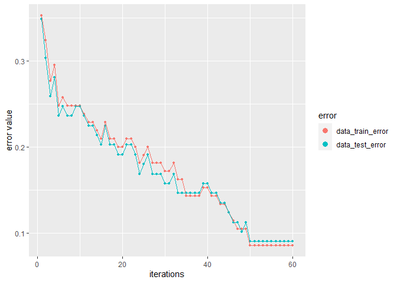
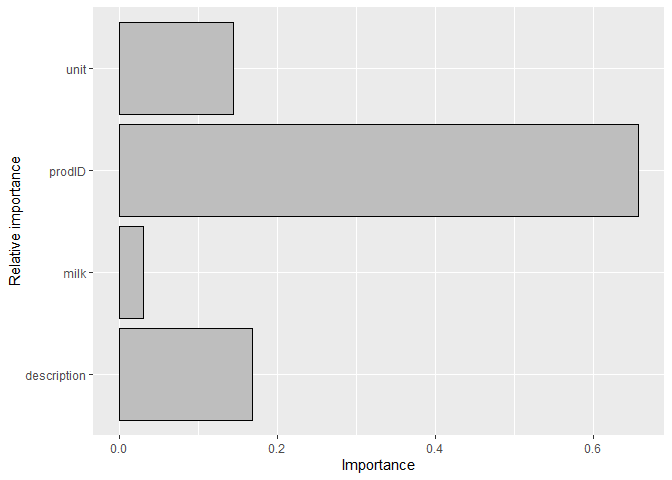
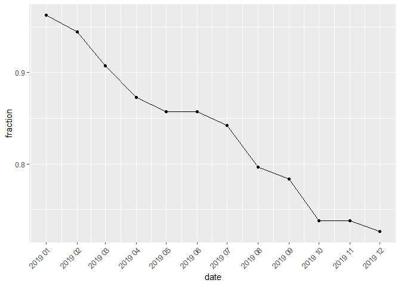
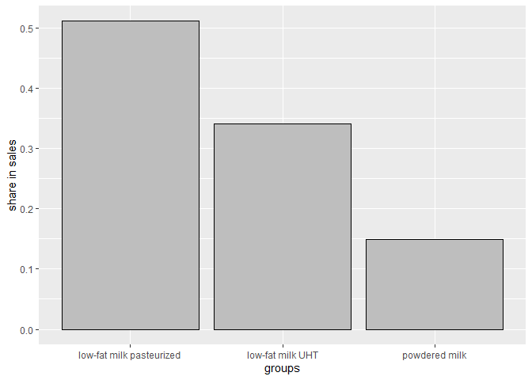
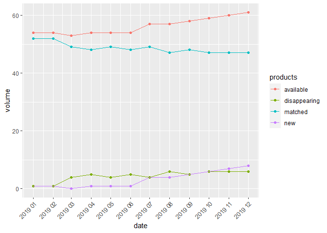
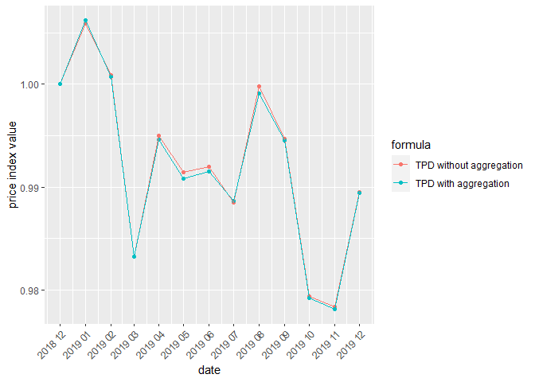

# PriceIndices – a Package for Bilateral and Multilateral Price Index Calculations

**author: Jacek Białek, University of Lodz, Statistics Poland** <!-- badges: start --> <!-- badges: end -->

Goals of PriceIndices are as follows: a) data processing before price index calculations; b) bilateral and multilateral price index calculations; c) extending multilateral price indices. You can download the package documentation from [here](https://github.com/JacekBialek/important_documents/blob/main/PriceIndices_manual.pdf).

## Installation

You can install the released version of **PriceIndices** from CRAN with:

``` r
install.packages("PriceIndices")
```

You can install the development version of **PriceIndices** from [GitHub](https://github.com/) with:

``` r
library("remotes")
remotes::install_github("JacekBialek/PriceIndices")
```

## The functionality of this package can be categorized as follows:

1.  <a href="#ad1">Data sets included in the package and generating artificial scanner data sets</a>
2.  <a href="#ad2">Functions for data processing</a>
3.  <a href="#ad3">Functions providing dataset characteristics</a>
4.  <a href="#ad4">Functions for bilateral unweighted price index calculation</a>
5.  <a href="#ad5">Functions for bilateral weighted price index calculation</a>
6.  <a href="#ad6">Functions for chain price index calculation</a>
7.  <a href="#ad7">Functions for multilateral price index calculation</a>
8.  <a href="#ad8">Functions for extending multilateral price indices by using splicing methods</a>
9.  <a href="#ad9">Functions for extending multilateral price indices by using the FBEW method</a>
10. <a href="#ad10">Functions for extending multilateral price indices by using the FBMW method</a>
11. <a href="#ad11">General functions for price index calculations</a>
12. <a href="#ad12">Functions for graphical comparison of price indices</a>

<a id="ad1"> </a>

### Data sets included in the package and generating artificial scanner data sets

**This package includes seven data sets: artificial and real.**

***1) dataAGGR***

The first one, **dataAGGR**, can be used to demonstrate the **data\_aggregating** function. This is a collection of artificial scanner data on milk products sold in three different months and it contains the following columns: **time** - dates of transactions (Year-Month-Day: 4 different dates); **prices** - prices of sold products (PLN); **quantities** - quantities of sold products (liters); *prodID* - unique product codes (3 different prodIDs); **retID** - unique codes identifying outlets/retailer sale points (4 different retIDs); **description** - descriptions of sold products (two subgroups: goat milk, powdered milk).

***2) dataMATCH***

The second one, **dataMATCH**, can be used to demonstrate the **data\_matching** function and it will be described in the next part of the guidelines. Generally, this artificial data set contains the following columns: **time** - dates of transactions (Year-Month-Day); **prices** - prices of sold products; **quantities** - quantities of sold products; **codeIN** - internal product codes from the retailer; **codeOUT** - external product codes, e.g. GTIN or SKU in the real case; **description** - descriptions of sold products, eg. 'product A', 'product B', etc.

***3) dataCOICOP***

The third one, **dataCOICOP**, is a collection of artificial scanner data on the sale of tomatoes, fruit juices, low fat milk, full fat milk, sugar, chocolate, yoghurt, coffee, eggs and salt in the period from December 2018 to October 2020. It is a data frame with 8 columns and 96600 rows. The used variables are as follows: **time** - dates of transactions (Year-Month-Day); **prices** - prices of sold products (PLN); **quantities** - quantities of sold products (liters); **prodID** - unique product codes obtained after product matching (data set contains 331 different prodIDs); **retID** - unique codes identifying outlets/retailer sale points (data set contains 10 different retIDs); **description** - descriptions of sold products (data set contains 12 different product descriptions), **unit** - sales units, e.g. 'kg', 'ml', etc.; **coicop** - identifiers of COICOP groups (10 groups). Please note that this data set can serve as a training or testing set in product classification using machine learning methods (see the functions: **model\_classification** and **data\_classifying**).

***4) milk***

This data set, **milk**, is a collection of scaner data on the sale of milk in one of Polish supermarkets in the period from December 2018 to August 2020. It is a data frame with 6 columns and 4281 rows. The used variables are as follows: **time** - dates of transactions (Year-Month-Day); **prices** - prices of sold products (PLN); **quantities** - quantities of sold products (liters); **prodID** - unique product codes obtained after product matching (data set contains 67 different prodIDs); **retID** - unique codes identifying outlets/retailer sale points (data set contains 5 different retIDs); **description** - descriptions of sold milk products (data set contains 6 different product descriptions corresponding to *subgroups* of the milk group).

***5) coffee***

This data set, **coffee**, is a collection of scanner data on the sale of coffee in one of Polish supermarkets in the period from December 2017 to October 2020. It is a data frame with 6 columns and 42561 rows. The used variables are as follows: **time** - dates of transactions (Year-Month-Day); **prices** - prices of sold products (PLN); **quantities** - quantities of sold products (kg); **prodID** - unique product codes obtained after product matching (data set contains 79 different prodIDs); **retID** - unique codes identifying outlets/retailer sale points (data set contains 20 different retIDs); **description** - descriptions of sold coffee products (data set contains 3 different product descriptions corresponding to *subgroups* of the coffee group).

***6) sugar***

This data set, **sugar**, is a collection of scanner data on the sale of coffee in one of Polish supermarkets in the period from December 2017 to October 2020. It is a data frame with 6 columns and 7666 rows. The used variables are as follows: **time** - dates of transactions (Year-Month-Day); **prices** - prices of sold products (PLN); **quantities** - quantities of sold products (kg); **prodID** - unique product codes obtained after product matching (data set contains 11 different prodIDs); **retID** - unique codes identifying outlets/retailer sale points (data set contains 20 different retIDs); **description** - descriptions of sold sugar products (data set contains 3 different product descriptions corresponding to *subgroups* of the sugar group).

***7) dataU***

This data set, **dataU**, is a collection of artificial scanner data on 6 products sold in Dec, 2018. Product descriptions contain the information about their grammage and unit. It is a data frame with 5 columns and 6 rows. The used variables are as follows: **time** - dates of transactions (Year-Month-Day); **prices** - prices of sold products (PLN); **quantities** - quantities of sold products (item); **prodID** - unique product codes; **description** - descriptions of sold products (data set contains 6 different product descriptions).

The set **milk** represents a typical data frame used in the package for most calculations and is organized as follows:

``` r
library(PriceIndices)
head(milk)
#>         time prices quantities prodID retID description
#> 1 2018-12-01   7.98        6.5 400032  1311   goat milk
#> 2 2018-12-01   7.98       91.5 400032  2210   goat milk
#> 3 2018-12-01   7.98       19.5 400032  6610   goat milk
#> 4 2018-12-01   7.98       15.5 400032  7611   goat milk
#> 5 2018-12-01   7.98       43.0 400032  8910   goat milk
#> 6 2019-01-01   7.98        4.5 400032  1311   goat milk
```

Available subgroups of sold milk are

``` r
unique(milk$description)
#> [1] "goat milk"                 "powdered milk"            
#> [3] "full-fat milk UHT"         "full-fat milk pasteurized"
#> [5] "low-fat milk UHT"          "low-fat milk pasteurized"
```

**Generating artificial scanner data sets in the package**

The package includes the **generate** function which provides an artificial scanner data sets where prices and quantities are lognormally distributed. The characteristics for these lognormal distributions are set by **pmi**, **sigma**, **qmi** and **qsigma** parameters. This function works for the fixed number of products and outlets (see **n** and **r** parameters). The generated data set is ready for further price index calculations. For instance:

``` r
dataset<-generate(pmi=c(1.02,1.03,1.04),psigma=c(0.05,0.09,0.02),
                  qmi=c(3,4,4),qsigma=c(0.1,0.1,0.15),
                  start="2020-01")
head(dataset)
#>         time prices quantities prodID retID
#> 1 2020-01-01   2.75         23      1     1
#> 2 2020-01-01   2.77         20      2     1
#> 3 2020-01-01   2.64         16      3     1
#> 4 2020-01-01   2.78         18      4     1
#> 5 2020-01-01   2.92         20      5     1
#> 6 2020-01-01   2.83         20      6     1
```

From the other hand you can use **tindex** function to obtain the theoretical value of the unweighted price index for lognormally distributed prices (the month defined by **start** parameter plays a role of the fixed base period). The characteristics for these lognormal distributions are set by **pmi** and **sigma** parameters. The **ratio** parameter is a logical parameter indicating how we define the theoretical unweighted price index. If it is set to TRUE then the resulting value is a ratio of expected price values from compared months; otherwise the resulting value is the expected value of the ratio of prices from compared months.The function provides a data frame consisting of dates and corresponding expected values of the theoretical unweighted price index. For example:

``` r
tindex(pmi=c(1.02,1.03,1.04),psigma=c(0.05,0.09,0.02),start="2020-01",ratio=FALSE)
#>      date   tindex
#> 1 2020-01 1.000000
#> 2 2020-02 1.012882
#> 3 2020-03 1.019131
```

<a id="ad2"> </a>

### Functions for data processing

**data\_preparing**

This function returns a prepared data frame based on the user's data set (you can check if your data set it is suitable for further price index calculation by using **data\_check** function). The resulting data frame is ready for further data processing (such as data selecting, matching or filtering) and it is also ready for price index calculations (if only it contains the required columns). The resulting data frame is free from missing values, zero or negative prices and quantities. As a result, the column **time** is set to be **Date** type (in format: 'Year-Month-01'), while the columns **prices** and **quantities** are set to be **numeric**. If the **description** parameter is set to *TRUE* then the column **description** is set to be **character** type (otherwise it is deleted). Please note that the **milk** set is an already prepared dataset but let us assume for a moment that we want to make sure that it does not contain missing values and we do not need the column **description** for further calculations. For this purpose, we use the **data\_preparing** function as follows:

``` r
head(data_preparing(milk, time="time",prices="prices",quantities="quantities"))
#>         time prices quantities
#> 1 2018-12-01   7.98        6.5
#> 2 2018-12-01   7.98       91.5
#> 3 2018-12-01   7.98       19.5
#> 4 2018-12-01   7.98       15.5
#> 5 2018-12-01   7.98       43.0
#> 6 2019-01-01   7.98        4.5
```

**data\_aggregating**

The function aggregates the user's data frame over time and/or over outlets. Consequently, we obtain monthly data, where the unit value is calculated instead of a price for each **prodID** observed in each month (the time column gets the Date format: "Year-Month-01"). If paramter **join\_outlets** is *TRUE*, then the function also performs aggregation over outlets (*retIDs*) and the **retID** column is removed from the data frame. The main advantage of using this function is the ability to reduce the size of the data frame and the time needed to calculate the price index. For instance, let us consider the following data set:

``` r
dataAGGR
#>         time prices quantities prodID retID   description
#> 1 2018-12-01     10        100 400032  4313     goat milk
#> 2 2018-12-01     15        100 400032  1311     goat milk
#> 3 2018-12-01     20        100 400032  1311     goat milk
#> 4 2020-07-01     20        100 400050  1311     goat milk
#> 5 2020-08-01     30         50 400050  1311     goat milk
#> 6 2020-08-01     40         50 400050  2210     goat milk
#> 7 2018-12-01     15        200 403249  2210 powdered milk
#> 8 2018-12-01     15        200 403249  2210 powdered milk
#> 9 2018-12-01     15        300 403249  2210 powdered milk
```

After aggregating this data set over time and outlets we obtain:

``` r
data_aggregating(dataAGGR)
#>         time prices quantities prodID   description
#> 1 2018-12-01     15        300 400032     goat milk
#> 2 2018-12-01     15        700 403249 powdered milk
#> 3 2020-07-01     20        100 400050     goat milk
#> 4 2020-08-01     35        100 400050     goat milk
```

**data\_unit**

The function returns the user's data frame with two additional columns: **grammage** and **unit** (both are character type). The values of these columns are extracted from product descriptions on the basis of provided **units**. Please note, that the function takes into consideration a sign of the multiplication, e.g. if the product description contains: '2x50 g', we will obtain: **grammage: 100** and **unit: g** for that product (for **multiplication** set to 'x'). For example:

``` r
data_unit(dataU,units=c("g","ml","kg","l"),multiplication="x")
#>         time prices quantities prodID          description grammage unit
#> 1 2018-12-01   8.00        200  40033 drink 0,75l 3% corma     0.75    l
#> 2 2018-12-01   5.20        300  12333          sugar 0.5kg      0.5   kg
#> 3 2018-12-01  10.34        100  20345         milk 4x500ml     2000   ml
#> 4 2018-12-01   2.60        500  15700 xyz 3 4.34 xyz 200 g      200    g
#> 5 2018-12-01  12.00       1000  13022                  abc        1 item
#> 6 2019-01-01   3.87        250  10011     ABC 2A/350 g mnk      350    g
```

**data\_norm**

The function returns the user's data frame with two transformed columns: **grammage** and **unit**, and two rescaled columns: **prices** and **quantities**. The above-mentioned transformation and rescaling take into consideration the user **rules**. Recalculated prices and quantities concern grammage units defined as the second parameter in the given rule. For instance:

``` r
# Preparing a data set
data<-data_unit(dataU,units=c("g","ml","kg","l"),multiplication="x")
# Normalization of grammage units
data_norm(data, rules=list(c("ml","l",1000),c("g","kg",1000)))
#>         time   prices quantities prodID          description grammage unit
#> 1 2018-12-01  5.17000      200.0  20345         milk 4x500ml        2    l
#> 2 2018-12-01 10.66667      150.0  40033 drink 0,75l 3% corma     0.75    l
#> 3 2018-12-01 13.00000      100.0  15700 xyz 3 4.34 xyz 200 g      0.2   kg
#> 4 2019-01-01 11.05714       87.5  10011     ABC 2A/350 g mnk     0.35   kg
#> 5 2018-12-01 10.40000      150.0  12333          sugar 0.5kg      0.5   kg
#> 6 2018-12-01 12.00000     1000.0  13022                  abc        1 item
```

**data\_selecting**

The function returns a subset of the user's data set obtained by selection based on keywords and phrases defined by parameters: **include**, **must** and **exclude** (an additional column **coicop** is optional). Providing values of these parameters, please remember that the procedure distinguishes between uppercase and lowercase letters only when **sensitivity** is set to *TRUE*.

For instance, please use

``` r
subgroup1<-data_selecting(milk, include=c("milk"), must=c("UHT"))
head(subgroup1)
#>         time prices quantities prodID retID       description
#> 1 2018-12-01   2.99        113  60010  1311 full-fat milk uht
#> 2 2018-12-01   2.29        650 401350  1311 full-fat milk uht
#> 3 2018-12-01   2.68        304 402570  1311 full-fat milk uht
#> 4 2018-12-01   2.65        137 405419  1311 full-fat milk uht
#> 5 2018-12-01   2.99        560  60010  2210 full-fat milk uht
#> 6 2018-12-01   2.50       1914 401350  2210 full-fat milk uht
```

to obtain the subset of **milk** limited to *UHT* category:

``` r
unique(subgroup1$description)
#> [1] "full-fat milk uht" "low-fat milk uht"
```

You can use

``` r
subgroup2<-data_selecting(milk, must=c("milk"), exclude=c("past","goat"))
head(subgroup2)
#>         time prices quantities prodID retID   description
#> 1 2018-12-01  19.58       10.5 403249  1311 powdered milk
#> 2 2018-12-01  19.58      154.5 403249  2210 powdered milk
#> 3 2018-12-01  19.58       88.5 403249  6610 powdered milk
#> 4 2018-12-01  19.58       75.0 403249  7611 powdered milk
#> 5 2018-12-01  19.58       18.0 403249  8910 powdered milk
#> 6 2018-12-01  69.95        1.0 400033  2210 powdered milk
```

to obtain the subset of **milk** with products which are not *pasteurized* and which are not **goat**:

``` r
unique(subgroup2$description)
#> [1] "powdered milk"     "full-fat milk uht" "low-fat milk uht"
```

**data\_classifying**

This function predicts product COICOP levels using the selected machine learning model (see the **model** parameter). It provides the indicated data set with an additional column, i.e. *coicop\_predicted*. The selected model must be built previously (see the **model\_classification** function) and after the training process it can be saved on your disk (see the **save\_model** function) and then loaded at any time (see the **load\_model** function). Please note that the machine learning process is based on the XGBoost algorithm (from the XGBoost package) which is an implementation of gradient boosted decision trees designed for speed and performance. For example, let us build a machine learning model

``` r
my.grid=list(eta=c(0.01,0.02,0.05),subsample=c(0.5))
data_train<-dplyr::filter(dataCOICOP,dataCOICOP$time<=as.Date("2020-08-01"))
data_test<-dplyr::filter(dataCOICOP,dataCOICOP$time>as.Date("2020-08-01"))
ML<-model_classification(data_train,
                         data_test,
                         grid=my.grid,
                         indicators=c("prodID","unit","description"),
                         key_words=c("milk"),rounds=50)
```

We can watch the results of the whole training process:

``` r
ML$figure_training
```



or we can observe the importance of the used indicators:

``` r
ML$figure_importance
```



Now, let us save the model on the disk. After saving the model we can load it and use at any time:

``` r
#Setting a temporary directory as a working directory
wd<-tempdir()
setwd(wd)
#Saving and loading the model
save_model(ML, dir="My_model")
ML_fromPC<-load_model("My_model")
#Prediction
data_predicted<-data_classifying(ML_fromPC, data_test)
head(data_predicted)
#>         time prices quantities        prodID retID    description
#> 1 2020-10-01   1.91         38 not available     5           milk
#> 2 2020-09-01   1.46        105 not available     2           milk
#> 3 2020-09-01   8.44        490 not available     5 no information
#> 4 2020-09-01   8.16        783 not available    10      chocolate
#> 5 2020-09-01   3.02        576 not available     2 no information
#> 6 2020-10-01   1.62         90 not available     5           milk
#>             unit coicop coicop_predicted
#> 1             ml  11421            11421
#> 2 no information  11421            11421
#> 3              g  11831            11831
#> 4              g  11831            11831
#> 5 no information  11811            11441
#> 6 no information  11421            11421
```

**data\_matching**

If you have a dataset with information about products sold but they are not matched you can use the **data\_matching** function. In an optimal situation, your data frame contains the **codeIN**, **codeOUT** and **description** columns (see documentation), which in practice will contain *retailer codes*, *GTIN* or *SKU* codes and *product labels*, respectively. The **data\_matching** function returns a data set defined in the first parameter (*data*) with an additional column (*prodID*). Two products are treated as being matched if they have the same prodID value. The procedure of generating the above-mentioned additional column depends on the set of chosen columns for matching (see documentation for details). For instance, let us suppose you want to obtain matched products from the following, artificial data set:

``` r
head(dataMATCH)
#>         time    prices quantities codeIN codeOUT retID description
#> 1 2018-12-01  9.416371        309      1       1     1   product A
#> 2 2019-01-01  9.881875        325      1       5     1   product A
#> 3 2019-02-01 12.611826        327      1       1     1   product A
#> 4 2018-12-01  9.598252        309      3       2     1   product A
#> 5 2019-01-01  9.684900        325      3       2     1   product A
#> 6 2019-02-01  9.358420        327      3       2     1   product A
```

Let us assume that products with two identical codes (**codeIN** and **codeOUT**) or one of the codes identical and an identical description are automatically matched. Products are also matched if they have one of the codes identical and the *Jaro-Winkler distance* of their descriptions is bigger than the fixed **precision** value (see documentation - *Case 1*). Let us also suppose that you want to match all products sold in the interval: December 2018 - February 2019. If you use the **data\_matching** function (as below), an additional column (**prodID**) will be added to your data frame:

``` r
data1<-data_matching(dataMATCH, start="2018-12",end="2019-02", codeIN=TRUE, codeOUT=TRUE, precision=.98, interval=TRUE)
head(data1)
#>         time    prices quantities codeIN codeOUT retID description prodID
#> 1 2018-12-01  9.416371        309      1       1     1   product A      4
#> 2 2019-01-01  9.881875        325      1       5     1   product A      4
#> 3 2019-02-01 12.611826        327      1       1     1   product A      4
#> 4 2018-12-01  9.598252        309      3       2     1   product A      9
#> 5 2019-01-01  9.684900        325      3       2     1   product A      9
#> 6 2019-02-01  9.358420        327      3       2     1   product A      9
```

Let us now suppose you do not want to consider **codeIN** while matching and that products with an identical **description** are to be matched too:

``` r
data2<-data_matching(dataMATCH, start="2018-12",end="2019-02", 
                     codeIN=FALSE, onlydescription=TRUE, interval=TRUE)
head(data2)
#>         time    prices quantities codeIN codeOUT retID description prodID
#> 1 2018-12-01  9.416371        309      1       1     1   product A      7
#> 2 2019-01-01  9.881875        325      1       5     1   product A      7
#> 3 2019-02-01 12.611826        327      1       1     1   product A      7
#> 4 2018-12-01  9.598252        309      3       2     1   product A      7
#> 5 2019-01-01  9.684900        325      3       2     1   product A      7
#> 6 2019-02-01  9.358420        327      3       2     1   product A      7
```

Now, having a **prodID** column, your datasets are ready for further price index calculations, e.g.:

``` r
fisher(data1, start="2018-12", end="2019-02")
#> [1] 1.018419
jevons(data2, start="2018-12", end="2019-02")
#> [1] 1.074934
```

**data\_filtering**

This function returns a filtered data set, i.e. a reduced user's data frame with the same columns and rows limited by a criterion defined by the **filters** parameter (see documentation). If the set of filters is empty then the function returns the original data frame (defined by the **data** parameter). On the other hand, if all filters are chosen, i.e. *filters=c(extremeprices, dumpprices, lowsales)*, then these filters work independently and a summary result is returned. Please note that both variants of the *extremeprices* filter can be chosen at the same time, i.e. *plimits* and *pquantiles*, and they work also independently. For example, let us assume we consider three filters: **filter1** is to reject 1% of the lowest and 1% of the highest price changes comparing March 2019 to December 2018, **filter2** is to reject products with the price ratio being less than 0.5 or bigger than 2 in the same time, **filter3** rejects the same products as **filter2** rejects and also products with relatively *low sale* in compared months, **filter4** rejects products with the price ratio being less than 0.9 and with the expenditure ratio being less than 0.8 in the same time.

``` r
filter1<-data_filtering(milk,start="2018-12",end="2019-03",
                        filters=c("extremeprices"),pquantiles=c(0.01,0.99))
filter2<-data_filtering(milk,start="2018-12",end="2019-03",
                        filters=c("extremeprices"),plimits=c(0.5,2))
filter3<-data_filtering(milk,start="2018-12",end="2019-03",
                        filters=c("extremeprices","lowsales"),plimits=c(0.5,2))
filter4<-data_filtering(milk,start="2018-12",end="2019-03",
                        filters=c("dumpprices"),dplimits=c(0.9,0.8))
```

These three filters differ from each other with regard to the data reduction level:

``` r
data_without_filters<-data_filtering(milk,start="2018-12",end="2019-03",filters=c())
nrow(data_without_filters)
#> [1] 403
nrow(filter1)
#> [1] 378
nrow(filter2)
#> [1] 381
nrow(filter3)
#> [1] 180
nrow(filter4)
#> [1] 374
```

You can also use **data\_filtering** for each pair of subsequent months from the considered time interval under the condition that this filtering is done for each outlet (**retID**) separately, e.g.

``` r
filter1B<-data_filtering(milk,start="2018-12",end="2019-03",
                         filters=c("extremeprices"),pquantiles=c(0.01,0.99),
                         interval=TRUE, retailers=TRUE)
nrow(filter1B)
#> [1] 773
```

<a id="ad3"> </a>

### Functions providing dataset characteristics

**available**

The function returns all values from the indicated column (defined by the **type** parameter) which occur at least once in one of compared periods or in a given time interval. Possible values of the **type** parameter are: **retID**, **prodID**, **codeIN**, **codeOUT** or **description** (see documentation). If the **interval** parameter is set to FALSE, then the function compares only periods defined by **period1** and **period2**. Otherwise the whole time period between period1 and period2 is considered. For example:

``` r
available(milk, period1="2018-12", period2="2019-12", type="retID",interval=TRUE)
#> [1] 1311 2210 6610 7611 8910
```

**matched**

The function returns all values from the indicated column (defined by the **type** parameter) which occur simultaneously in the compared periods or in a given time interval.Possible values of the **type** parameter are: **retID**, **prodID**, **codeIN**, **codeOUT** or **description** (see documentation). If the **interval** parameter is set to FALSE, then the function compares only periods defined by **period1** and **period2**. Otherwise the whole time period between period1 and period2 is considered. For example:

``` r
matched(milk, period1="2018-12", period2="2019-12", type="prodID",interval=TRUE)
#>  [1] 400032 403249 400033 402609 406223 406224  14216 400189 400194 400195
#> [11] 400196 402601 402602  60010 401350 402570 405419 406245  74431  34540
#> [21] 402263 404005 407670 407860 407220  82830  15404 406247  17034 406246
#> [31] 401347 402569 405420  70397  82919  94256 402264 404004 407669 407859
#> [41] 407219  82827 402293 407709
```

**matched\_index**

The function returns a ratio of values from the indicated column that occur simultaneously in the compared periods or in a given time interval to all available values from the above-mentioned column (defined by the **type** parameter) at the same time. Possible values of the **type** parameter are: **retID**, **prodID**, **codeIN**, **codeOUT** or **description** (see documentation). If the **interval** parameter is set to FALSE, then the function compares only periods defined by period1 and period2. Otherwise the whole time period between period1 and period2 is considered. The returned value is from 0 to 1. For example:

``` r
matched_index(milk, period1="2018-12", period2="2019-12", type="prodID",interval=TRUE)
#> [1] 0.7213115
```

**matched\_fig**

The function returns a **data frame** or a **figure** presenting the **matched\_index** function calculated for the column defined by the **type** parameter and for each month from the considered time interval. The interval is set by the **start** and **end** parameters. The returned object (data frame or figure) depends on the value of the **figure** parameter. Examples:

``` r
matched_fig(milk, start="2018-12", end="2019-12", type="prodID")
```



``` r
matched_fig(milk, start="2018-12", end="2019-04", type="prodID", figure=FALSE)
#>      date  fraction
#> 1 2019-01 0.9622642
#> 2 2019-02 0.9433962
#> 3 2019-03 0.9056604
#> 4 2019-04 0.8703704
```

**prices**

The function returns prices (unit value) of products with a given ID (**prodID** column) and being sold in the time period indicated by the **period** parameter. The **set** parameter means a set of unique product IDs to be used for determining prices of sold products. If the set is empty the function returns prices of all products being available in the **period**. To get prices (unit values) of all available milk products sold in July, 2019, please use:

``` r
prices(milk, period="2019-06")
#>  [1]  7.980000 19.502286 64.057143 15.266667  6.029412  6.441176  8.700000
#>  [8]  8.669455 18.972121 12.622225  9.914052  7.102823  7.970131  9.901111
#> [15]  2.990000  2.527874  2.590000  2.371819  2.090000  2.236250  1.990000
#> [22]  1.810000  2.674401  2.683688  2.813238  2.680000  2.860000  4.702051
#> [29]  1.890000  1.890000  2.950000  2.163273  1.990000  3.180000  2.490000
#> [36]  2.490000  2.834464  2.400000  2.588644  3.790911  1.650548  2.231947
#> [43]  2.584184  1.450000  3.266000  2.810000  2.790000  2.390000
```

**quantities**

The function returns quantities of products with a given ID (**prodID** column) and being sold in the time period indicated by the **period** parameter. The **set** parameter means a set of unique product IDs to be used for determining prices of sold products. If the set is empty the function returns quantities of all products being available in the **period**. To get quantities of milk products with prodIDs: 400032, 71772 and 82919, and sold in July, 2019, please use:

``` r
quantities(milk, period="2019-06", set=c(400032, 71772, 82919))
#> [1] 114.5 117.0 102.0
```

**sales**

The function returns values of sales of products with a given ID (**prodID** column) and being sold in the time period indicated by **period** parameter. The **set** parameter means a set of unique product IDs to be used for determining prices of sold products. If the set is empty the function returns values of sales of all products being available in the **period**. To get values of sales of milk products with prodIDs: 400032, 71772 and 82919, and sold in July, 2019, please use:

``` r
sales(milk, period="2019-06", set=c(400032, 71772, 82919))
#> [1] 913.71 550.14 244.80
```

**sales\_groups**

The function returns **values of sales** of products from one or more **datasets** or the corresponding **barplot** for these sales (if **barplot** is set to TRUE). Alternatively, it calculates the **sale shares** (if the **shares** parameter is set to TRUE). Please see also the **sales\_groups2** function. As an example, let us create 3 subgroups of **milk** products and let us find out their sale shares for the time interval: April, 2019 - July, 2019. We can obtain precise values for the given **period**:

``` r
ctg<-unique(milk$description)
categories<-c(ctg[1],ctg[2],ctg[3])
milk1<-dplyr::filter(milk, milk$description==categories[1])
milk2<-dplyr::filter(milk, milk$description==categories[2])
milk3<-dplyr::filter(milk, milk$description==categories[3])
sales_groups(datasets=list(milk1,milk2,milk3),start="2019-04", end="2019-07")
#> [1]   3954.09  44400.76 168247.46
sales_groups(datasets=list(milk1,milk2,milk3),start="2019-04", end="2019-07", shares=TRUE)
#> [1] 0.01825507 0.20498747 0.77675746
```

or a barplot presenting these results:

``` r
sales_groups(datasets=list(milk1,milk2,milk3),start="2019-04", end="2019-07", 
             barplot=TRUE, shares=TRUE, names=categories)
```

 **pqcor**

The function returns **Pearson's correlation coefficient** for price and quantity of products with given IDs (defined by the **set** parameter) and sold in the **period**. If the **set** is empty, the function works for all products being available in the **period**. The **figure** parameter indicates whether the function returns a figure with a correlation coefficient (TRUE) or just a correlation coefficient (FALSE). For instance:

``` r
pqcor(milk, period="2019-05")
#> [1] -0.2035
pqcor(milk, period="2019-05",figure=TRUE)
```

 **pqcor\_fig**

The function returns **Pearson's correlation coefficients** between price and quantity of products with given IDs (defined by the **set** parameter) and sold in the time interval defined by the **start** and **end** parameters. If the **set** is empty the function works for all available products. Correlation coefficients are calculated for each month separately. Results are presented in tabular or graphical form depending on the **figure** parameter. Both cases are presented below:

``` r
pqcor_fig(milk, start="2018-12", end="2019-06", figure=FALSE)
#>      date correlation
#> 1 2018-12     -0.1819
#> 2 2019-01     -0.1772
#> 3 2019-02     -0.1792
#> 4 2019-03     -0.1944
#> 5 2019-04     -0.1960
#> 6 2019-05     -0.2035
#> 7 2019-06     -0.2022
pqcor_fig(milk, start="2018-12", end="2019-06")
```

 **dissimilarity**

This function returns a value of the relative price (dSP) and/or quantity (dSQ) dissimilarity measure. In a special case, when the **type** parameter is set to **pq**, the function provides the value of dSPQ measure (relative price and quantity dissimilarity measure calculated as **min(dSP,dSQ)**. For instance:

``` r
dissimilarity(milk, period1="2018-12",period2="2019-12",type="pq")
#> [1] 0.00004258112
```

**dissimilarity\_fig**

This function presents values of the relative price and/or quantity dissimilarity measure over time. The user can choose a benchmark period (defined by **benchmark**) and the type of dissimilarity measure is to be calculated (defined by **type**). The obtained results of dissimilarities over time can be presented in a dataframe form or via a figure (the default value of **figure** is TRUE which results a figure). For instance:

``` r
dissimilarity_fig(milk, start="2018-12",end="2019-12",type="pq",benchmark="start")
```

 <a id="ad4"> </a>

### Functions for bilateral unweighted price index calculation

This package includes 6 functions for calculating the following bilateral unweighted price indices:

| Price Index      | Function |
|------------------|----------|
| BMW (2007)       | bmw      |
| Carli (1804)     | carli    |
| CSWD (1980,1992) | cswd     |
| Dutot (1738)     | dutot    |
| Jevons (1865)    | jevons   |
| Harmonic         | harmonic |

Each of these functions returns a value (or vector of values) of the choosen unweighted bilateral price index depending on the **interval** parameter. If the interval parameter is set to TRUE, the function returns a vector of price index values without dates. To get information about both price index values and corresponding dates please see general functions: **price\_index**, **price\_indices** or **final\_index**. None of these functions takes into account aggregating over outlets or product subgroups (to consider these types of aggregating please use the **final\_index** function.) Below are examples of calculations for the Jevons index (in the second case a *fixed base month* is set to December 2018):

``` r
jevons(milk, start="2018-12", end="2020-01")
#> [1] 1.028862
jevons(milk, start="2018-12", end="2020-01", interval=TRUE)
#>  [1] 1.0000000 1.0227271 1.0306252 1.0361275 1.0076198 1.0403077 0.9850525
#>  [8] 1.0053768 1.0034188 1.0181678 1.0248130 1.0088363 1.0255585 1.0288617
```

<a id="ad5"> </a>

### Functions for bilateral weighted price index calculation

This package includes 26 functions for calculating the following bilateral weighted price indices:

| Price Index               | Function            |
|---------------------------|---------------------|
| AG Mean (2009)            | agmean              |
| Banajree (1977)           | banajree            |
| Bialek (2012,2013)        | bialek              |
| Davies (1924)             | davies              |
| Drobisch (1871)           | drobisch            |
| Fisher (1922)             | fisher              |
| Geary-Khamis (1958,1970)  | geary\_khamis       |
| Geo-Laspeyres             | geolaspeyres        |
| Geo-Lowe                  | geolowe             |
| Geo-Paasche               | geopaasche          |
| Geo-Young                 | geoyoung            |
| Geo-hybrid (2020)         | geohybrid           |
| Hybrid (2020)             | hybrid              |
| Laspeyres (1871)          | laspeyres           |
| Lehr (1885)               | lehr                |
| Lloyd-Moulton (1975,1996) | lloyd\_moulton      |
| Lowe                      | lowe                |
| Marshall-Edgeworth (1887) | marshall\_edgeworth |
| Paasche (1874)            | paasche             |
| Palgrave (1886)           | palgrave            |
| Sato-Vartia (1976)        | sato\_vartia        |
| Stuvel (1957)             | stuvel              |
| Tornqvist (1936)          | tornqvist           |
| Vartia (1976)             | vartia              |
| Walsh (1901)              | walsh               |
| Young                     | young               |

Each of these functions returns a value (or vector of values) of the choosen weighted bilateral price index depending on the **interval** parameter. If interval parameter is set to TRUE, the function returns a vector of price index values without dates. To get information about both price index values and corresponding dates please see general functions: **price\_index**, **price\_indices** or **final\_index**. None of these functions takes into account aggregating over outlets or product subgroups (to consider these types of aggregating please use the **final\_index** function.) Below are examples of calculations for the Fisher, the Lloyd-Moulton and the Lowe indices (in the last case, the *fixed base month* is set to December 2019 and the *prior* period is December 2018):

``` r
fisher(milk, start="2018-12", end="2020-01")
#> [1] 0.9613153
lloyd_moulton(milk, start="2018-12", end="2020-01", sigma=0.9)
#> [1] 0.9833808
lowe(milk, start="2019-12", end="2020-02", base="2018-12", interval=TRUE)
#> [1] 1.0000000 0.9879382 1.0024140
```

<a id="ad6"> </a>

### Functions for chain price index calculation

This package includes 32 functions for calculating the following chain price indices (weighted and unweighted):

| Price Index              | Function              |
|--------------------------|-----------------------|
| Chain BMW                | chbmw                 |
| Chain Carli              | chcarli               |
| Chain CSWD               | chcswd                |
| Chain Dutot              | chdutot               |
| Chain Jevons             | chjevons              |
| Chain Harmonic           | chharmonic            |
| Chain AG Mean            | chagmean              |
| Chain Banajree           | chbanajree            |
| Chain Bialek             | chbialek              |
| Chain Davies             | chdavies              |
| Chain Drobisch           | chdrobisch            |
| Chain Fisher             | chfisher              |
| Chain Geary-Khamis       | chgeary\_khamis       |
| Chain Geo-Laspeyres      | chgeolaspeyres        |
| Chain Geo-Lowe           | chgeolowe             |
| Chain Geo-Paasche        | chgeopaasche          |
| Chain Geo-Young          | chgeoyoung            |
| Chain Geo-hybrid         | chgeohybrid           |
| Chain Hybrid             | chhybrid              |
| Chain Laspeyres          | chlaspeyres           |
| Chain Lehr               | chlehr                |
| Chain Lloyd-Moulton      | chlloyd\_moulton      |
| Chain Lowe               | chlowe                |
| Chain Marshall-Edgeworth | chmarshall\_edgeworth |
| Chain Paasche            | chpaasche             |
| Chain Palgrave           | chpalgrave            |
| Chain Sato-Vartia        | chsato\_vartia        |
| Chain Stuvel             | chstuvel              |
| Chain Tornqvist          | chtornqvist           |
| Chain Vartia             | chvartia              |
| Chain Walsh              | chwalsh               |
| Chain Young              | chyoung               |

Each time, the **interval** parameter has a logical value indicating whether the function is to compare the research period defined by **end** to the base period defined by **start** (then **interval** is set to FALSE and it is a default value) or all fixed base indices are to be calculated. In this second case, all months from the time interval **<start,end>** are considered and **start** defines the base period (**interval** is set to TRUE). Here are examples for the Fisher chain index:

``` r
chfisher(milk, start="2018-12", end="2020-01")
#> [1] 0.9615496
chfisher(milk, start="2018-12", end="2020-01", interval=TRUE)
#>  [1] 1.0000000 1.0021874 1.0004589 0.9861511 0.9943142 0.9914703 0.9897306
#>  [8] 0.9875189 0.9981165 0.9968423 0.9784270 0.9770267 0.9873297 0.9615496
```

<a id="ad7"> </a>

### Functions for multilateral price index calculation

This package includes 9 functions for calculating multilateral price indices and one additional and general function (**QU**) which calculates the quality adjusted unit value index, i.e.:

| Price Index                 | Function |
|-----------------------------|----------|
| CCDI                        | ccdi     |
| GEKS                        | geks     |
| GEKS-J                      | geksj    |
| GEKS-W                      | geksw    |
| GEKS-L                      | geksl    |
| WGEKS-L                     | wgeksl   |
| Geary-Khamis                | gk       |
| Quality Adjusted Unit Value | QU       |
| Time Product Dummy          | tpd      |
| SPQ                         | SPQ      |

The above-mentioned 8 multilateral formulas (the **SPQ** index is an exception) consider the time window defined by the **wstart** and **window** parameters, where **window** is a length of the time window (typically multilateral methods are based on a 13-month time window). It measures the price dynamics by comparing the **end** period to the **start** period (both **start** and **end** must be inside the considered time window). To get information about both price index values and corresponding dates, please see functions: **price\_index**, **price\_indices** or **final\_index**. These functions do not take into account aggregating over outlets or product subgroups (to consider these types of aggregating please use functions: **final\_index** or **final\_index2**). Here are examples for the GEKS formula (see documentation):

``` r
geks(milk, start="2019-01", end="2019-04",window=10)
#> [1] 0.9911205
geksl(milk, wstart="2018-12", start="2019-03", end="2019-05")
#> [1] 1.002247
```

The **QU** function returns a value of the *quality adjusted unit value index* (QU index) for the given set of adjustment factors. An additional **v** parameter is a data frame with adjustment factors for at least all matched **prodIDs**. It must contain two columns: **prodID** with unique product IDs and **value** with corresponding adjustment factors (see documentation). The following example starts from creating a data frame which includes sample adjusted factors:

``` r
prodID<-base::unique(milk$prodID)
values<-stats::runif(length(prodID),1,2)
v<-data.frame(prodID,values)
head(v)
#>   prodID   values
#> 1 400032 1.287785
#> 2 403249 1.837677
#> 3 400033 1.529563
#> 4 402609 1.362896
#> 5 406223 1.346118
#> 6 406224 1.671687
```

and the next step is calculating the QU index which compares December 2019 to December 2018:

``` r
QU(milk, start="2018-12", end="2019-12", v)
#> [1] 0.9907554
```

<a id="ad8"> </a>

### Functions for extending multilateral price indices by using splicing methods

This package includes 8 functions for calculating splice indices:

| Price Index               | Function       |
|---------------------------|----------------|
| Splice CCDI               | ccdi\_splcie   |
| Splice GEKS               | geks\_splice   |
| Splice GEKS-J             | geksj\_splice  |
| Splice GEKS-W             | geksw\_splice  |
| Splice GEKS-L             | geksl\_splice  |
| Splice weighted GEKS-L    | wgeksl\_splice |
| Splice Geary-Khamis       | gk\_splice     |
| Splice Time Product Dummy | tpd\_splice    |

These functions return a value (or values) of the selected multilateral price index extended by using window splicing methods (defined by the **splice** parameter). Available splicing methods are: **movement splice**, **window splice**, **half splice**, **mean splice** and their additional variants: **window splice on published indices (WISP)**, **half splice on published indices (HASP)** and **mean splice on published indices** (see documentation). The first considered time window is defined by the **start** and **window** parameters, where **window** is a length of the time window (typically multilateral methods are based on a 13-month time window). Functions measure the price dynamics by comparing the **end** period to the **start** period, i.e. if the time interval **<start, end>** exceeds the defined time window then splicing methods are used. If the **interval** parameter is set to TRUE, then all fixed base multilateral indices are presented (the fixed base month is defined by **start**). To get information about both price index values and corresponding dates, please see functions: **price\_index**, **price\_indices** or **final\_index**. These functions do not take into account aggregating over outlets or product subgroups (to consider these types of aggregating, please use the **final\_index** function). For instance, let us calculate the **extended Time Product Dummy** index by using the **half splice method** with a 10-month time window:

``` r
tpd_splice(milk, start="2018-12", end="2020-02",window=10,splice="half",interval=TRUE)
#>  [1] 1.0000000 1.0034052 0.9997846 0.9830298 0.9949289 0.9921140 0.9907993
#>  [8] 0.9860539 0.9994174 0.9944681 0.9803287 0.9812484 0.9888518 0.9626117
#> [15] 1.0020928
```

<a id="ad9"> </a>

### Functions for extending multilateral price indices by using the FBEW method

This package includes 8 functions for calculating extensions of multilateral indices by using the Fixed Base Monthly Expanding Window (FBEW) method:

| Price Index             | Function     |
|-------------------------|--------------|
| FBEW CCDI               | ccdi\_fbew   |
| FBEW GEKS               | geks\_fbew   |
| FBEW GEKS-J             | geksj\_fbew  |
| FBEW GEKS-W             | geksw\_fbew  |
| FBEW GEKS-L             | geksl\_fbew  |
| FBEW WGEKS-L            | wgeksl\_fbew |
| FBEW Geary-Khamis       | gk\_fbew     |
| FBEW Time Product Dummy | tpd\_fbew    |

These functions return a value (or values) of the selected multilateral price index extended by using the FBEW method. The FBEW method uses a time window with a fixed base month every year (December). The window is enlarged every month with one month in order to include information from a new month. The full window length (13 months) is reached in December of each year. These functions measure the price dynamics between the **end** and **start** periods. A month of the **start** parameter must be December (see documentation). If the distance between **end** and **start** exceeds 13 months, then internal Decembers play a role of chain-linking months. To get information about both price index values and corresponding dates please see functions: **price\_index**, **price\_indices** or **final\_index**. These functions do not take into account aggregating over outlets or product subgroups (to consider these types of aggregating, please use the **final\_index** function). For instance, let us calculate the **extended GEKS** index by using the FBEW method. Please note that December 2019 is the chain-linking month, i.e.:

``` r
geks_fbew(milk, start="2018-12", end="2020-03")
#> [1] 0.9890676
  geks_fbew(milk, start="2018-12", end="2019-12")*
  geks_fbew(milk, start="2019-12", end="2020-03")
#> [1] 0.9890676
```

<a id="ad10"> </a>

### Functions for extending multilateral price indices by using the FBMW method

This package includes 8 functions for calculating extensions of multilateral indices by using the Fixed Base Moving Window (FBMW) method:

| Price Index             | Function     |
|-------------------------|--------------|
| FBMW CCDI               | ccdi\_fbmw   |
| FBMW GEKS               | geks\_fbmw   |
| FBMW GEKS-J             | geksj\_fbmw  |
| FBMW GEKS-W             | geksw\_fbmw  |
| FBMW GEKS-L             | geksl\_fbmw  |
| FBMW WGEKS-L            | wgeksl\_fbmw |
| FBMW Geary-Khamis       | gk\_fbmw     |
| FBMW Time Product Dummy | tpd\_fbmw    |

These functions return a value (or values) of the selected multilateral price index extended by using the FBMW method. They measure the price dynamics between the **end** and **start** periods and it uses a 13-month time window with a fixed base month taken as **year(end)-1**. If the distance between **end** and **start** exceeds 13 months, then internal Decembers play a role of chain-linking months. A month of the **start** parameter must be December (see documentation). To get information about both price index values and corresponding dates, please see functions: **price\_index**, **price\_indices** or **final\_index**. These functions do not take into account aggregating over outlets or product subgroups (to consider these types of aggregating, please use the **final\_index** function). For instance, let us calculate the **extended CCDI** index by using the FBMW method. Please note that December 2019 is the chain-linking month, i.e.:

``` r
ccdi_fbmw(milk, start="2018-12", end="2020-03")
#> [1] 0.9873102
    ccdi_fbmw(milk, start="2018-12", end="2019-12")*
    ccdi_fbmw(milk, start="2019-12", end="2020-03")
#> [1] 0.9873102
```

<a id="ad11"> </a>

### General functions for price index calculations

This package includes 3 general functions for price index calculation. The **start** and **end** parameters indicate the base and the research period respectively. These function provide value or values (depending on the **interval** parameter) of the selected price index formula or formulas. If the **interval** parameter is set to **TRUE** then it returns a data frame with two columns: **dates** and **index values**. Functions **price\_index** and **price\_indices** do not take into account aggregating over outlets or product subgroups and to consider these types of aggregating, please use functions: **final\_index** or **final\_index2**.

**price\_index**

This function returns a value or values of the selected price index. The **formula** parameter is a character string indicating the price index formula is to be calculated (see documentation). If the selected price index formula needs some additional information it should be defined by additional parameters: **window** and **splice** (connected with multilateral indices), **base** (adequate for the Young and the Lowe indices) or **sigma** (for the Lloyd-Moulton or the AG mean indices). Sample use:

``` r
price_index(milk, start="2019-05", end="2019-06", formula="fisher")
#> [1] 0.9982454
price_index(milk, start="2018-12", end="2020-02",
            formula="tpd_splice",splice="movement",interval=TRUE)
#>       date tpd_splice
#> 1  2018-12  1.0000000
#> 2  2019-01  1.0058919
#> 3  2019-02  1.0009019
#> 4  2019-03  0.9832469
#> 5  2019-04  0.9950177
#> 6  2019-05  0.9914660
#> 7  2019-06  0.9919629
#> 8  2019-07  0.9885075
#> 9  2019-08  0.9997805
#> 10 2019-09  0.9946831
#> 11 2019-10  0.9794113
#> 12 2019-11  0.9783548
#> 13 2019-12  0.9895292
#> 14 2020-01  0.9623072
#> 15 2020-02  1.0031225
```

**price\_indices**

This is an extended version of the **price\_index** function because it allows us to compare many price index formulas by using one command. The general character of this function mean that, for instance, your one command may calculate two CES indices for two different values of **sigma** parameter (the elasticity of substitution) or you can select several splice indices and calculate them by using different window lengths and different splicing method. You can control names of columns in the resulting data frame by defining additional parameters: **namebilateral**, **namebindex**, **namecesindex**, **namefbmulti**, **namesplicemulti** although their default values correspond to the used price index formulas. Please note that this function is not the most general in the package, i.e. all selected price indices are calculated for the same data set defined by the **data** parameter and the aggregation over subgroups or outlets are not taken into consideration here (to consider it, please use functions: **final\_index** or **final\_index2**).

For instance, let us use the **milk** data set and let us calculate the price dynamics for the time interval December 2019 - August 2020) using the following price index formulas: the **Fisher** index, the **Young** index with the prior period set to December 2018, the **AG mean** index with the elasticity of substitution parameter **sigma=0.5**, the full-window **GEKS** index with a 9-month window length, the full-window **Geary-Khamis** index with a 9-month window length, the splice **TPD** index using a 6-month time window and being extended by using the **movement splice** method:

``` r
price_indices(milk, start="2019-12", end="2020-08", bilateral=c("fisher"), 
              bindex=c("young"), base=c("2018-12"), 
              cesindex=c("agmean"), sigma=c(0.5), 
              fbmulti=c("geks", "gk"), fbwindow=c(9,9), 
              splicemulti=c("tpd_splice"),splicewindow=c(6), 
              splice=c("movement"), interval=TRUE)
#>      date    fisher     young    agmean      geks        gk tpd_splice
#> 1 2019-12 1.0000000 1.0000000 1.0000000 1.0000000 1.0000000  1.0000000
#> 2 2020-01 0.9738891 0.9891646 0.9939640 0.9750266 0.9693130  0.9732830
#> 3 2020-02 1.0123415 1.0039094 1.0140796 1.0087883 1.0106985  1.0101760
#> 4 2020-03 1.0024037 0.9996002 1.0039339 0.9992815 1.0004526  0.9998948
#> 5 2020-04 0.9777865 0.9895585 0.9972551 0.9750276 0.9708036  0.9769588
#> 6 2020-05 1.0140321 1.0138042 1.0202523 1.0147363 1.0163318  1.0154608
#> 7 2020-06 0.9946660 1.0000850 1.0071414 0.9991348 1.0032779  1.0053921
#> 8 2020-07 1.0033760 1.0041679 1.0090685 1.0063868 1.0077830  1.0098781
#> 9 2020-08 1.0112388 1.0096740 1.0148145 1.0113609 1.0151099  1.0154043
```

**final\_index**

This function returns a value or values of the selected (final) price index taking into consideration aggregation over product subgroups and/or over outlets (retailer sale points defined in the **retID** column). If the **interval** parameter is set to TRUE, then it returns a data frame with two columns: dates and final index values (after optional aggregating). Please note that different index formulas may use different time intervals (or time periods) for calculations and, each time, if the **aggrret** parameter differs from "none", aggregation over outlets is done for the set of retIDs being available during all considered months. Moreover, for each outlet, i.e. each **retID** code, the set of considered **prodID** codes is limited to those codes which are available simultaneously in all considered months.

**Details:** the **datasets** parameter defines the user's list of data frames with subgroups of sold products (see documentation). The **formula** parameter is a character string indicating the price index formula is to be calculated (see documentation). If the selected price index formula needs some additional information, it should be defined by additional parameters: **window** and **splice** (connected with multilateral indices), **base** (adequate for the Young and the Lowe indices) or **sigma** (for the Lloyd-Moulton or the AG mean indices). The **aggrret** parameter is a character string indicating the formula for aggregation over outlets (retailer sale points defined in the **retID** column). Available options are: **none**, **laspeyres**, **paasche**, **geolaspeyres**, **geopaasche**, **fisher**, **tornqvist**, **arithmetic** and **geometric**. The first option means that there is no aggregating over outlets. The last two options mean unweighted methods of aggregating, i.e. the arithmetic or the geometric mean is used. Similarly, the **aggrsets** parameter is a character string indicating the formula for aggregation over product subgroups with identical options as previously.

**Example**. Let us define two subgroups of **milk**:

``` r
g1<-dplyr::filter(milk, milk$description=="full-fat milk UHT")
g2<-dplyr::filter(milk, milk$description=="low-fat milk UHT")
```

Now, for the fixed time interval: December 2018 - May 2019, let us calculate the (final) chain Walsh price index (the fixed base month is December 2018) taking into consideration the Laspeyres aggregation over subgroups **g1** and **g2** and the Fisher aggregation over outlets:

``` r
final_index(datasets=list(g1,g2), start="2018-12", end="2019-05", 
            formula="chwalsh", 
            aggrsets = "laspeyres", aggrret = "fisher", 
            interval=TRUE)
#>      date   chwalsh
#> 1 2018-12 1.0000000
#> 2 2019-01 1.0028836
#> 3 2019-02 1.0044375
#> 4 2019-03 1.0088699
#> 5 2019-04 1.0072593
#> 6 2019-05 0.9868345
```

**final\_index2**

This function returns a value or values of the selected (final) price index taking into consideration aggregation over product subgroups and/or over outlets. Optionally, the function returns a data frame or a figure presenting calculated indices, i.e. the price index for the whole data set and price indices for product subgroups. If the **interval** parameter is set to TRUE, then it returns a data frame (or a figure) with dates and final index values (after optional aggregating). Please note that different index formulas may use different time intervals (or time periods) for calculations and, each time, if the **aggrret** parameter differs from "none", aggregation over outlets is done for the set of retIDs being available during all considered months. Moreover, for each outlet, i.e. each **retID** code, the set of considered **prodID** codes is limited to those codes which are available simultaneously in all considered months.

**Details:** the **data** parameter defines the user's data frame with subgroups of sold products (see documentation). The **by** parameter indicates a grouping variable name, i.e. this column is used for creating subgroups of products. The **all** parameter is a logical value indicating whether the the selected price index is to be calculated only for the whole set of products or also for created subgroups of products (then **all** is set to TRUE). The **formula** parameter is a character string indicating the price index formula is to be calculated (see documentation). If the selected price index formula needs some additional information, it should be defined by additional parameters: **window** and **splice** (connected with multilateral indices), **base** (adequate for the Young and the Lowe indices) or **sigma** (for the Lloyd-Moulton or the AG mean indices). The **aggrret** parameter is a character string indicating the formula for aggregation over outlets (retailer sale points defined in the **retID** column). Available options are: **none**, **laspeyres**, **paasche**, **geolaspeyres**, **geopaasche**, **fisher**, **tornqvist**, **arithmetic** and **geometric**. The first option means that there is no aggregating over outlets. The last two options mean unweighted methods of aggregating, i.e. the arithmetic or the geometric mean is used. Similarly, the **aggrsets** parameter is a character string indicating the formula for aggregation over product subgroups with identical options as previously. Finally, the **figure** parameter is a logical value indicating whether the function returns a figure presenting all calculated indices (it works if **all** and **interval** are set to TRUE)

**Examples**. Let us calculate the final Fisher price index (with Laspeyres-type aggregation over subgroups) for the whole data set on **coffee** and for each product subgroup:

``` r
final_index2(data=coffee, by="description",all=TRUE,
             start="2018-12",end="2019-12", 
             formula="fisher",
             interval=TRUE,
             aggrsets="laspeyres",aggrret="none",
             figure=FALSE)
#>       date fisher : all groups instant coffee coffee beans ground coffee
#> 1  2018-12           1.0000000      1.0000000    1.0000000     1.0000000
#> 2  2019-01           1.0027599      0.9902984    0.9535798     1.0237694
#> 3  2019-02           1.0115692      0.9753682    1.0992467     1.0144109
#> 4  2019-03           0.9887958      0.9502669    1.0784389     0.9927472
#> 5  2019-04           0.9970437      0.9702892    0.9979700     1.0152654
#> 6  2019-05           1.0108262      0.9421379    1.1001929     1.0356516
#> 7  2019-06           1.0744676      1.0164235    1.0527764     1.1199823
#> 8  2019-07           1.0538767      1.0738491    1.0577020     1.0391339
#> 9  2019-08           1.0379242      1.0225298    1.0998945     1.0329018
#> 10 2019-09           1.0595009      0.9965613    1.0598688     1.1028247
#> 11 2019-10           1.0545770      1.0435102    1.0507304     1.0631821
#> 12 2019-11           0.9879396      0.9683038    1.0094456     0.9960565
#> 13 2019-12           1.0017515      1.0207062    0.9730540     0.9959198
```

and that can be presented in a figure:

``` r
final_index2(data=coffee, by="description",all=TRUE,
             start="2018-12",end="2019-12", formula="fisher",
             interval=TRUE,
             aggrsets="laspeyres",aggrret="none",
             figure=TRUE)
```


Now, let us calculate and plot the same price index (with no aggregation) for each **retID**:

``` r
final_index2(data=coffee, by="retID",all=TRUE,
             start="2018-12",end="2019-12", formula="fisher",
             interval=TRUE,
             aggrsets="none",aggrret="none",
             figure=TRUE)
```



<a id="ad12"> </a>

### Functions for graphical comparison of price indices

This package includes 2 functions for a simple graphical comparison of price indices. The first one, i.e. **compare\_indices** is based on the syntax of the **price\_indices** function and thus it allows us to compare price indices calculated on the same data set. The second function, i.e. **compare\_final\_indices** has a general character since its first argument is a list of data frames which contain results obtained by using the **price\_index**, **final\_index** or **final\_index2** functions.

**compare\_indices**

This function calculates selected bilateral or/and multilateral price indices and returns a figure with plots of these indices (together with **dates** on X-axis and a corresponding **legend**). The function does not take into account aggregating over outlets or product subgroups (to consider these types of aggregating please use functions: **final\_index** and **compare\_final\_indices**). Please note that the syntax of the function corresponds to the syntax of the **price\_indices** function (the meaning of parameters is the same - see documentation). For instance, let us compare the price dynamics for the **milk** dataset for the time interval: December 2018 - December 2019, calculated by using two price index formulas: the chain Jevons index and the full-window GEKS index. The above-mentioned comparison can be made as follows:

``` r
compare_indices(milk, start="2018-12",end="2019-12",bilateral=c("chjevons"),
                fbmulti=c("geks"),fbwindow=c(13), 
                namebilateral=c("Chain Jevons"), namefbmulti=c("Full GEKS"))
```


**compare\_final\_indices**

This function returns a figure with plots of previously calculated price indices. It allows for graphical comparison of price index values which were previously calculated and now are provided as data frames. To be more precise: the **finalindices** parameter is a list of data frames with previously calculated price indices. Each data frame must consist of two columns, i.e. the first column must include dates limited to the year and month and the second column must indicate price index values for corresponding dates. The above-mentioned single data frame may be created manually in the previous step or it may be a result of functions: **price\_index** or **final\_index**. All considered data frames must have an identical number of rows. The **names** parameter is a vector of character strings describing names of presented indices.

For instance, let us compare the impact of the aggregating over outlets on the price index results (e.g. the Fisher formula is the assumed aggregating method). For this purpose, let us calculate the full-window **TPD index** in two cases: **case1** without the above-mentioned aggregation and **case2** which considers that aggregation. We use the **milk** dataset and the yearly time interval:

``` r
case1<-price_index(milk, start="2018-12",end="2019-12",
                   formula="tpd", interval=TRUE)
case2<-final_index(datasets=list(milk), start="2018-12", end="2019-12", 
                   formula="tpd", aggrsets="none", aggrret = "fisher", 
                   interval=TRUE)
```

The comparison of obtained results can be made as follows (it may be time-consuming on your computer):

``` r
compare_final_indices(finalindices=list(case1, case2),names=c("TPD without aggregation","TPD with aggregation"))
```


