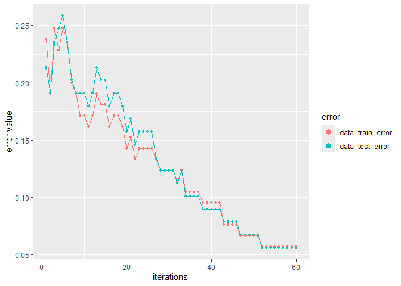
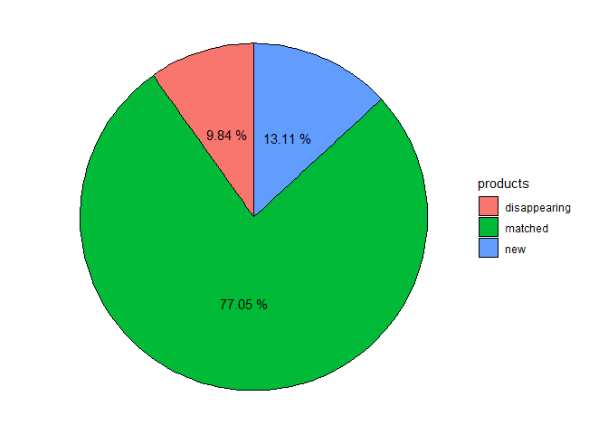

---
output:
  word_document: default
  html_document: default
---

# PriceIndices – a Package for Bilateral and Multilateral Price Index Calculations

**author: Jacek Białek, University of Lodz, Statistics Poland** <!-- badges: start --> <!-- badges: end -->

Goals of PriceIndices are as follows: a) data processing before price index calculations; b) bilateral and multilateral price index calculations; c) extending multilateral price indices. You can download the package documentation from [here](https://github.com/JacekBialek/important_documents/blob/main/PriceIndices_manual.pdf). Too read more about the package please see (and cite :)) papers:

Białek, J. (2021). PriceIndices – a New R Package for Bilateral and Multilateral Price Index Calculations, Statistika – Statistics and Economy Journal, Vol. 2/2021, 122-141, Czech Statistical Office, Praga.

Białek, J. (2022). Scanner data processing in a newest version of the PriceIndices package, Statistical Journal of the IAOS, 38 (4), 1369-1397, DOI: 10.3233/SJI-220963.

## Installation

You can install the released version of **PriceIndices** from CRAN with:

``` r
install.packages("PriceIndices")
```

You can install the development version of **PriceIndices** from [GitHub](https://github.com/) with:

``` r
library("remotes")
remotes::install_github("JacekBialek/PriceIndices")
```

## The functionality of this package can be categorized as follows:

1.  <a href="#ad1">Data sets included in the package and generating artificial scanner data sets</a>
2.  <a href="#ad2">Functions for data processing</a>
3.  <a href="#ad3">Functions providing dataset characteristics</a>
4.  <a href="#ad4">Functions for bilateral unweighted price index calculations</a>
5.  <a href="#ad5">Functions for bilateral weighted price index calculations</a>
6.  <a href="#ad6">Functions for chain price index calculations</a>
7.  <a href="#ad7">Functions for multilateral price index calculations</a>
8.  <a href="#ad8">Functions for extending multilateral price indices by using splicing methods</a>
9.  <a href="#ad9">Functions for extending multilateral price indices by using the FBEW method</a>
10. <a href="#ad10">Functions for extending multilateral price indices by using the FBMW method</a>
11. <a href="#ad11">General functions for price index calculations</a>
12. <a href="#ad12">Functions for comparisons of price indices</a>
13. <a href="#ad13">Functions for price and quantity indicator calculations</a>

<a id="ad1"> </a>

### Data sets included in the package and generating artificial scanner data sets

**This package includes seven data sets: artificial and real.**

***1) dataAGGR***

The first one, **dataAGGR**, can be used to demonstrate the **data\_aggregating** function. This is a collection of artificial scanner data on milk products sold in three different months and it contains the following columns: **time** - dates of transactions (Year-Month-Day: 4 different dates); **prices** - prices of sold products (PLN); **quantities** - quantities of sold products (liters); *prodID* - unique product codes (3 different prodIDs); **retID** - unique codes identifying outlets/retailer sale points (4 different retIDs); **description** - descriptions of sold products (two subgroups: goat milk, powdered milk).

***2) dataMATCH***

The second one, **dataMATCH**, can be used to demonstrate the **data\_matching** function and it will be described in the next part of the guidelines. Generally, this artificial data set contains the following columns: **time** - dates of transactions (Year-Month-Day); **prices** - prices of sold products; **quantities** - quantities of sold products; **codeIN** - internal product codes from the retailer; **codeOUT** - external product codes, e.g. GTIN or SKU in the real case; **description** - descriptions of sold products, eg. 'product A', 'product B', etc.

***3) dataCOICOP***

The third one, **dataCOICOP**, is a ollection of real scanner data on the sale of milk products sold in a period: Dec, 2020 - Feb, 2022. It is a data frame with 10 columns and 139600 rows. The used variables are as follows: **time** - dates of transactions (Year-Month-Day); **prices** - prices of sold products (PLN); **quantities** - quantities of sold products; **description** - descriptions of sold products (original: in Polish); **codeID** - retailer product codes; **retID** - IDs of retailer outlets; **grammage** - product grammages; **unit** - sales units, e.g. 'kg', 'ml', etc.; **category** - product categories (in English) corresponding to COICOP 6 levels; **coicop6** - identifiers of local COICOP 6 groups (6 levels). Please note that this data set can serve as a training or testing set in product classification using machine learning methods (see the functions: **model\_classification** and **data\_classifying**).

***4) milk***

This data set, **milk**, is a collection of scaner data on the sale of milk in one of Polish supermarkets in the period from December 2018 to August 2020. It is a data frame with 6 columns and 4386 rows. The used variables are as follows: **time** - dates of transactions (Year-Month-Day); **prices** - prices of sold products (PLN); **quantities** - quantities of sold products (liters); **prodID** - unique product codes obtained after product matching (data set contains 68 different prodIDs); **retID** - unique codes identifying outlets/retailer sale points (data set contains 5 different retIDs); **description** - descriptions of sold milk products (data set contains 6 different product descriptions corresponding to *subgroups* of the milk group).

***5) coffee***

This data set, **coffee**, is a collection of scanner data on the sale of coffee in one of Polish supermarkets in the period from December 2017 to October 2020. It is a data frame with 6 columns and 42561 rows. The used variables are as follows: **time** - dates of transactions (Year-Month-Day); **prices** - prices of sold products (PLN); **quantities** - quantities of sold products (kg); **prodID** - unique product codes obtained after product matching (data set contains 79 different prodIDs); **retID** - unique codes identifying outlets/retailer sale points (data set contains 20 different retIDs); **description** - descriptions of sold coffee products (data set contains 3 different product descriptions corresponding to *subgroups* of the coffee group).

***6) sugar***

This data set, **sugar**, is a collection of scanner data on the sale of coffee in one of Polish supermarkets in the period from December 2017 to October 2020. It is a data frame with 6 columns and 7666 rows. The used variables are as follows: **time** - dates of transactions (Year-Month-Day); **prices** - prices of sold products (PLN); **quantities** - quantities of sold products (kg); **prodID** - unique product codes obtained after product matching (data set contains 11 different prodIDs); **retID** - unique codes identifying outlets/retailer sale points (data set contains 20 different retIDs); **description** - descriptions of sold sugar products (data set contains 3 different product descriptions corresponding to *subgroups* of the sugar group).

***7) dataU***

This data set, **dataU**, is a collection of artificial scanner data on 6 products sold in Dec, 2018. Product descriptions contain the information about their grammage and unit. It is a data frame with 5 columns and 6 rows. The used variables are as follows: **time** - dates of transactions (Year-Month-Day); **prices** - prices of sold products (PLN); **quantities** - quantities of sold products (item); **prodID** - unique product codes; **description** - descriptions of sold products (data set contains 6 different product descriptions).

The set **milk** represents a typical data frame used in the package for most calculations and is organized as follows:

``` r
library(PriceIndices)
head(milk)
#>         time prices quantities prodID retID   description
#> 1 2018-12-01   8.78        9.0  14215  2210 powdered milk
#> 2 2019-01-01   8.78       13.5  14215  2210 powdered milk
#> 3 2019-02-01   8.78        0.5  14215  1311 powdered milk
#> 4 2019-02-01   8.78        8.0  14215  2210 powdered milk
#> 5 2019-03-01   8.78        0.5  14215  1311 powdered milk
#> 6 2019-03-01   8.78        1.5  14215  2210 powdered milk
```

Available subgroups of sold milk are

``` r
unique(milk$description)
#> [1] "powdered milk"             "low-fat milk pasteurized" 
#> [3] "low-fat milk UHT"          "full-fat milk pasteurized"
#> [5] "full-fat milk UHT"         "goat milk"
```

**Generating artificial scanner data sets in the package**

The package includes the **generate** function which provides an artificial scanner data sets where prices and quantities are lognormally distributed. The characteristics for these lognormal distributions are set by **pmi**, **sigma**, **qmi** and **qsigma** parameters. This function works for the fixed number of products and outlets (see **n** and **r** parameters). The generated data set is ready for further price index calculations. For instance:

``` r
dataset<-generate(pmi=c(1.02,1.03,1.04),psigma=c(0.05,0.09,0.02),
                  qmi=c(3,4,4),qsigma=c(0.1,0.1,0.15),
                  start="2020-01")
head(dataset)
#>         time prices quantities prodID retID
#> 1 2020-01-01   2.95         20      1     1
#> 2 2020-01-01   2.67         21      2     1
#> 3 2020-01-01   2.87         23      3     1
#> 4 2020-01-01   2.98         22      4     1
#> 5 2020-01-01   2.65         21      5     1
#> 6 2020-01-01   2.67         20      6     1
```

From the other hand you can use **tindex** function to obtain the theoretical value of the unweighted price index for lognormally distributed prices (the month defined by **start** parameter plays a role of the fixed base period). The characteristics for these lognormal distributions are set by **pmi** and **sigma** parameters. The **ratio** parameter is a logical parameter indicating how we define the theoretical unweighted price index. If it is set to TRUE then the resulting value is a ratio of expected price values from compared months; otherwise the resulting value is the expected value of the ratio of prices from compared months.The function provides a data frame consisting of dates and corresponding expected values of the theoretical unweighted price index. For example:

``` r
tindex(pmi=c(1.02,1.03,1.04),psigma=c(0.05,0.09,0.02),start="2020-01",ratio=FALSE)
#>      date   tindex
#> 1 2020-01 1.000000
#> 2 2020-02 1.012882
#> 3 2020-03 1.019131
```

The User may also generate an artificial scanner dataset where prices are lognormally distributed and quantities are calculated under the assumption that consumers have CES (Constant Elasticity of Substitution) preferences and their spending on all products is fixed (see the **generate\_CES** function). Please watch the following example:

``` r
#Generating an artificial dataset (the elasticity of substitution is 1.25)
df<-generate_CES(pmi=c(1.02,1.03),psigma=c(0.04,0.03),
elasticity=1.25,start="2020-01",n=100,days=TRUE)
head(df)
#>         time prices quantities prodID retID
#> 1 2020-01-08   2.74  3.1582043      1     1
#> 2 2020-01-04   2.80  4.2876173      2     1
#> 3 2020-01-13   2.48  3.0196874      3     1
#> 4 2020-01-09   2.93  3.9875946      4     1
#> 5 2020-01-03   2.77  7.6189109      5     1
#> 6 2020-01-20   2.87  0.8750079      6     1
```

Now, we can verify the value of elasticity of substitution using this generated dataset:

``` r
#Verifying the elasticity of substitution
elasticity(df, start="2020-01",end="2020-02")
#> [1] 1.25
```

<a id="ad2"> </a>

### Functions for data processing

**data\_preparing**

This function returns a prepared data frame based on the user's data set (you can check if your data set it is suitable for further price index calculation by using **data\_check** function). The resulting data frame is ready for further data processing (such as data selecting, matching or filtering) and it is also ready for price index calculations (if only it contains the required columns). The resulting data frame is free from missing values, zero or negative prices and quantities. As a result, the column **time** is set to be **Date** type (in format: 'Year-Month-01'), while the columns **prices** and **quantities** are set to be **numeric**. If the **description** parameter is set to *TRUE* then the column **description** is set to be **character** type (otherwise it is deleted). Please note that the **milk** set is an already prepared dataset but let us assume for a moment that we want to make sure that it does not contain missing values and we do not need the column **description** for further calculations. For this purpose, we use the **data\_preparing** function as follows:

``` r
head(data_preparing(milk, time="time",prices="prices",quantities="quantities"))
#>         time prices quantities
#> 1 2018-12-01   8.78        9.0
#> 2 2019-01-01   8.78       13.5
#> 3 2019-02-01   8.78        0.5
#> 4 2019-02-01   8.78        8.0
#> 5 2019-03-01   8.78        0.5
#> 6 2019-03-01   8.78        1.5
```

**data\_aggregating**

The function aggregates the user's data frame over time and/or over outlets. Consequently, we obtain monthly data, where the unit value is calculated instead of a price for each **prodID** observed in each month (the time column gets the Date format: "Year-Month-01"). If paramter **join\_outlets** is *TRUE*, then the function also performs aggregation over outlets (*retIDs*) and the **retID** column is removed from the data frame. The main advantage of using this function is the ability to reduce the size of the data frame and the time needed to calculate the price index. For instance, let us consider the following data set:

``` r
dataAGGR
#>         time prices quantities prodID retID   description
#> 1 2018-12-01     10        100 400032  4313     goat milk
#> 2 2018-12-01     15        100 400032  1311     goat milk
#> 3 2018-12-01     20        100 400032  1311     goat milk
#> 4 2020-07-01     20        100 400050  1311     goat milk
#> 5 2020-08-01     30         50 400050  1311     goat milk
#> 6 2020-08-01     40         50 400050  2210     goat milk
#> 7 2018-12-01     15        200 403249  2210 powdered milk
#> 8 2018-12-01     15        200 403249  2210 powdered milk
#> 9 2018-12-01     15        300 403249  2210 powdered milk
```

After aggregating this data set over time and outlets we obtain:

``` r
data_aggregating(dataAGGR)
#> # A tibble: 4 x 4
#>   time       prodID prices quantities
#>   <date>      <int>  <dbl>      <int>
#> 1 2018-12-01 400032     15        300
#> 2 2018-12-01 403249     15        700
#> 3 2020-07-01 400050     20        100
#> 4 2020-08-01 400050     35        100
```

**data\_unit**

The function returns the user's data frame with two additional columns: **grammage** and **unit** (both are character type). The values of these columns are extracted from product descriptions on the basis of provided **units**. Please note, that the function takes into consideration a sign of the multiplication, e.g. if the product description contains: '2x50 g', we will obtain: **grammage: 100** and **unit: g** for that product (for **multiplication** set to 'x'). For example:

``` r
data_unit(dataU,units=c("g","ml","kg","l"),multiplication="x")
#>         time prices quantities prodID          description grammage unit
#> 1 2018-12-01   8.00        200  40033 drink 0,75l 3% corma     0.75    l
#> 2 2018-12-01   5.20        300  12333          sugar 0.5kg      0.5   kg
#> 3 2018-12-01  10.34        100  20345         milk 4x500ml     2000   ml
#> 4 2018-12-01   2.60        500  15700 xyz 3 4.34 xyz 200 g      200    g
#> 5 2018-12-01  12.00       1000  13022                  abc        1 item
#> 6 2019-01-01   3.87        250  10011     ABC 2A/350 g mnk      350    g
```

**data\_norm**

The function returns the user's data frame with two transformed columns: **grammage** and **unit**, and two rescaled columns: **prices** and **quantities**. The above-mentioned transformation and rescaling take into consideration the user **rules**. Recalculated prices and quantities concern grammage units defined as the second parameter in the given rule. For instance:

``` r
# Preparing a data set
data<-data_unit(dataU,units=c("g","ml","kg","l"),multiplication="x")
# Normalization of grammage units
data_norm(data, rules=list(c("ml","l",1000),c("g","kg",1000)))
#>         time   prices quantities prodID          description grammage unit
#> 1 2018-12-01  5.17000      200.0  20345         milk 4x500ml        2    l
#> 2 2018-12-01 10.66667      150.0  40033 drink 0,75l 3% corma     0.75    l
#> 3 2018-12-01 13.00000      100.0  15700 xyz 3 4.34 xyz 200 g      0.2   kg
#> 4 2019-01-01 11.05714       87.5  10011     ABC 2A/350 g mnk     0.35   kg
#> 5 2018-12-01 10.40000      150.0  12333          sugar 0.5kg      0.5   kg
#> 6 2018-12-01 12.00000     1000.0  13022                  abc        1 item
```

**data\_selecting**

The function returns a subset of the user's data set obtained by selection based on keywords and phrases defined by parameters: **include**, **must** and **exclude** (an additional column **coicop** is optional). Providing values of these parameters, please remember that the procedure distinguishes between uppercase and lowercase letters only when **sensitivity** is set to *TRUE*.

For instance, please use

``` r
subgroup1<-data_selecting(milk, include=c("milk"), must=c("UHT"))
head(subgroup1)
#>         time prices quantities prodID retID      description
#> 1 2018-12-01   2.97         78  17034  1311 low-fat milk uht
#> 2 2018-12-01   2.97        167  17034  2210 low-fat milk uht
#> 3 2018-12-01   2.97        119  17034  6610 low-fat milk uht
#> 4 2018-12-01   2.97         32  17034  7611 low-fat milk uht
#> 5 2018-12-01   2.97         54  17034  8910 low-fat milk uht
#> 6 2019-01-01   2.95         71  17034  1311 low-fat milk uht
```

to obtain the subset of **milk** limited to *UHT* category:

``` r
unique(subgroup1$description)
#> [1] "low-fat milk uht"  "full-fat milk uht"
```

You can use

``` r
subgroup2<-data_selecting(milk, must=c("milk"), exclude=c("past","goat"))
head(subgroup2)
#>         time prices quantities prodID retID   description
#> 1 2018-12-01   8.78        9.0  14215  2210 powdered milk
#> 2 2019-01-01   8.78       13.5  14215  2210 powdered milk
#> 3 2019-02-01   8.78        0.5  14215  1311 powdered milk
#> 4 2019-02-01   8.78        8.0  14215  2210 powdered milk
#> 5 2019-03-01   8.78        0.5  14215  1311 powdered milk
#> 6 2019-03-01   8.78        1.5  14215  2210 powdered milk
```

to obtain the subset of **milk** with products which are not *pasteurized* and which are not **goat**:

``` r
unique(subgroup2$description)
#> [1] "powdered milk"     "low-fat milk uht"  "full-fat milk uht"
```

**data\_classifying**

This function predicts product COICOP levels (or any other defined product levels) using the selected machine learning model (see the **model** parameter). It provides the indicated data set with an additional column, i.e. *coicop\_predicted*. The selected model must be built previously (see the **model\_classification** function) and after the training process it can be saved on your disk (see the **save\_model** function) and then loaded at any time (see the **load\_model** function). Please note that the machine learning process is based on the XGBoost algorithm (from the XGBoost package) which is an implementation of gradient boosted decision trees designed for speed and performance. For example, let us build a machine learning model

``` r
my.grid=list(eta=c(0.01,0.02,0.05),subsample=c(0.5,0.8))
data_train<-dplyr::filter(dataCOICOP,dataCOICOP$time<=as.Date("2021-10-01"))
data_test<-dplyr::filter(dataCOICOP,dataCOICOP$time==as.Date("2021-11-01"))
ML<-model_classification(data_train,
                         data_test,
                         coicop="coicop6",
                         grid=my.grid,
                         indicators=c("description","codeIN"),
                         key_words=c("uht"), 
                         rounds=60)
```

We can watch the results of the whole training process:

``` r
ML$figure_training
```


or we can observe the importance of the used indicators:

``` r
ML$figure_importance
```



Now, let us save the model on the disk. After saving the model we can load it and use at any time:

``` r
#Setting a temporary directory as a working directory
wd<-tempdir()
setwd(wd)
#Saving and loading the model
save_model(ML, dir="My_model")
ML_fromPC<-load_model("My_model")
#Prediction
data_predicted<-data_classifying(ML_fromPC, data_test)
head(data_predicted)
#>         time prices quantities                            description codeIN
#> 1 2021-11-01   3.03        379 g/wydojone mleko bez laktozyuht 3,2%1l  60001
#> 2 2021-11-01   3.03        856 g/wydojone mleko bez laktozyuht 3,2%1l  60001
#> 3 2021-11-01   3.03        369 g/wydojone mleko bez laktozyuht 3,2%1l  60001
#> 4 2021-11-01   3.03        617 g/wydojone mleko bez laktozyuht 3,2%1l  60001
#> 5 2021-11-01   3.03        613 g/wydojone mleko bez laktozyuht 3,2%1l  60001
#> 6 2021-11-01   3.03        261 g/wydojone mleko bez laktozyuht 3,2%1l  60001
#>   retID grammage unit       category coicop6 coicop_predicted
#> 1     2        1    l UHT whole milk 11411_1          11411_1
#> 2     3        1    l UHT whole milk 11411_1          11411_1
#> 3     4        1    l UHT whole milk 11411_1          11411_1
#> 4     5        1    l UHT whole milk 11411_1          11411_1
#> 5     6        1    l UHT whole milk 11411_1          11411_1
#> 6     7        1    l UHT whole milk 11411_1          11411_1
```

**data\_matching**

If you have a dataset with information about products sold but they are not matched you can use the **data\_matching** function. In an optimal situation, your data frame contains the **codeIN**, **codeOUT** and **description** columns (see documentation), which in practice will contain *retailer codes*, *GTIN* or *SKU* codes and *product labels*, respectively. The **data\_matching** function returns a data set defined in the first parameter (*data*) with an additional column (*prodID*). Two products are treated as being matched if they have the same prodID value. The procedure of generating the above-mentioned additional column depends on the set of chosen columns for matching (see documentation for details). For instance, let us suppose you want to obtain matched products from the following, artificial data set:

``` r
head(dataMATCH)
#>         time    prices quantities codeIN codeOUT retID description
#> 1 2018-12-01  9.416371        309      1       1     1   product A
#> 2 2019-01-01  9.881875        325      1       5     1   product A
#> 3 2019-02-01 12.611826        327      1       1     1   product A
#> 4 2018-12-01  9.598252        309      3       2     1   product A
#> 5 2019-01-01  9.684900        325      3       2     1   product A
#> 6 2019-02-01  9.358420        327      3       2     1   product A
```

Let us assume that products with two identical codes (**codeIN** and **codeOUT**) or one of the codes identical and an identical description are automatically matched. Products are also matched if they have one of the codes identical and the *Jaro-Winkler similarity* of their descriptions is bigger than the fixed **precision** value (see documentation - *Case 1*). Let us also suppose that you want to match all products sold in the interval: December 2018 - February 2019. If you use the **data\_matching** function (as below), an additional column (**prodID**) will be added to your data frame:

``` r
data1<-data_matching(dataMATCH, start="2018-12",end="2019-02", codeIN=TRUE, codeOUT=TRUE, precision=.98, interval=TRUE)
head(data1)
#>         time    prices quantities codeIN codeOUT retID description prodID
#> 1 2018-12-01  9.416371        309      1       1     1   product A      4
#> 2 2019-01-01  9.881875        325      1       5     1   product A      4
#> 3 2019-02-01 12.611826        327      1       1     1   product A      4
#> 4 2018-12-01  9.598252        309      3       2     1   product A      8
#> 5 2019-01-01  9.684900        325      3       2     1   product A      8
#> 6 2019-02-01  9.358420        327      3       2     1   product A      8
```

Let us now suppose you do not want to consider **codeIN** while matching and that products with an identical **description** are to be matched too:

``` r
data2<-data_matching(dataMATCH, start="2018-12",end="2019-02", 
                     codeIN=FALSE, onlydescription=TRUE, interval=TRUE)
head(data2)
#>         time    prices quantities codeIN codeOUT retID description prodID
#> 1 2018-12-01  9.416371        309      1       1     1   product A      7
#> 2 2019-01-01  9.881875        325      1       5     1   product A      7
#> 3 2019-02-01 12.611826        327      1       1     1   product A      7
#> 4 2018-12-01  9.598252        309      3       2     1   product A      7
#> 5 2019-01-01  9.684900        325      3       2     1   product A      7
#> 6 2019-02-01  9.358420        327      3       2     1   product A      7
```

Now, having a **prodID** column, your datasets are ready for further price index calculations, e.g.:

``` r
fisher(data1, start="2018-12", end="2019-02")
#> [1] 1.018419
jevons(data2, start="2018-12", end="2019-02")
#> [1] 1.074934
```

**data\_filtering**

This function returns a filtered data set, i.e. a reduced user's data frame with the same columns and rows limited by a criterion defined by the **filters** parameter (see documentation). If the set of filters is empty then the function returns the original data frame (defined by the **data** parameter). On the other hand, if all filters are chosen, i.e. *filters=c(extremeprices, dumpprices, lowsales)*, then these filters work independently and a summary result is returned. Please note that both variants of the *extremeprices* filter can be chosen at the same time, i.e. *plimits* and *pquantiles*, and they work also independently. For example, let us assume we consider three filters: **filter1** is to reject 1% of the lowest and 1% of the highest price changes comparing March 2019 to December 2018, **filter2** is to reject products with the price ratio being less than 0.5 or bigger than 2 in the same time, **filter3** rejects the same products as **filter2** rejects and also products with relatively *low sale* in compared months, **filter4** rejects products with the price ratio being less than 0.9 and with the expenditure ratio being less than 0.8 in the same time.

``` r
filter1<-data_filtering(milk,start="2018-12",end="2019-03",
                        filters=c("extremeprices"),pquantiles=c(0.01,0.99))
filter2<-data_filtering(milk,start="2018-12",end="2019-03",
                        filters=c("extremeprices"),plimits=c(0.5,2))
filter3<-data_filtering(milk,start="2018-12",end="2019-03",
                        filters=c("extremeprices","lowsales"),plimits=c(0.5,2))
filter4<-data_filtering(milk,start="2018-12",end="2019-03",
                        filters=c("dumpprices"),dplimits=c(0.9,0.8))
```

These three filters differ from each other with regard to the data reduction level:

``` r
data_without_filters<-data_filtering(milk,start="2018-12",end="2019-03",filters=c())
nrow(data_without_filters)
#> [1] 413
nrow(filter1)
#> [1] 378
nrow(filter2)
#> [1] 381
nrow(filter3)
#> [1] 170
nrow(filter4)
#> [1] 374
```

You can also use **data\_filtering** for each pair of subsequent months from the considered time interval under the condition that this filtering is done for each outlet (**retID**) separately, e.g.

``` r
filter1B<-data_filtering(milk,start="2018-12",end="2019-03",
                         filters=c("extremeprices"),pquantiles=c(0.01,0.99),
                         interval=TRUE, retailers=TRUE)
nrow(filter1B)
#> [1] 773
```

<a id="ad3"> </a>

### Functions providing dataset characteristics

**available**

The function returns all values from the indicated column (defined by the **type** parameter) which occur at least once in one of compared periods or in a given time interval. Possible values of the **type** parameter are: **retID**, **prodID**, **codeIN**, **codeOUT** or **description** (see documentation). If the **interval** parameter is set to FALSE, then the function compares only periods defined by **period1** and **period2**. Otherwise the whole time period between period1 and period2 is considered. For example:

``` r
available(milk, period1="2018-12", period2="2019-12", type="retID",interval=TRUE)
#> [1] 2210 1311 6610 7611 8910
```

**matched**

The function returns all values from the indicated column (defined by the **type** parameter) which occur simultaneously in the compared periods or in a given time interval.Possible values of the **type** parameter are: **retID**, **prodID**, **codeIN**, **codeOUT** or **description** (see documentation). If the **interval** parameter is set to FALSE, then the function compares only periods defined by **period1** and **period2**. Otherwise the whole time period between period1 and period2 is considered. For example:

``` r
matched(milk, period1="2018-12", period2="2019-12", type="prodID",interval=TRUE)
#>  [1]  14216  15404  17034  34540  60010  70397  74431  82827  82830  82919
#> [11]  94256 400032 400033 400189 400194 400195 400196 401347 401350 402263
#> [21] 402264 402293 402569 402570 402601 402602 402609 403249 404004 404005
#> [31] 405419 405420 406223 406224 406245 406246 406247 407219 407220 407669
#> [41] 407670 407709 407859 407860 400099
```

**matched\_index**

The function returns a ratio of values from the indicated column that occur simultaneously in the compared periods or in a given time interval to all available values from the above-mentioned column (defined by the **type** parameter) at the same time. Possible values of the **type** parameter are: **retID**, **prodID**, **codeIN**, **codeOUT** or **description** (see documentation). If the **interval** parameter is set to FALSE, then the function compares only periods defined by period1 and period2. Otherwise the whole time period between period1 and period2 is considered. The returned value is from 0 to 1. For example:

``` r
matched_index(milk, period1="2018-12", period2="2019-12", type="prodID",interval=TRUE)
#> [1] 0.7258065
```

**matched\_fig**

The function returns a **data frame** or a **figure** presenting the **matched\_index** function calculated for the column defined by the **type** parameter and for each month from the considered time interval. The interval is set by the **start** and **end** parameters. The returned object (data frame or figure) depends on the value of the **figure** parameter. Examples:

``` r
matched_fig(milk, start="2018-12", end="2019-12", type="prodID")
```


``` r
matched_fig(milk, start="2018-12", end="2019-04", type="prodID", figure=FALSE)
#>      date  fraction
#> 1 2018-12 1.0000000
#> 2 2019-01 0.9629630
#> 3 2019-02 0.9444444
#> 4 2019-03 0.9074074
#> 5 2019-04 0.8727273
```

**prices**

The function returns prices (unit value) of products with a given ID (**prodID** column) and being sold in the time period indicated by the **period** parameter. The **set** parameter means a set of unique product IDs to be used for determining prices of sold products. If the set is empty the function returns prices of all products being available in the **period**. Please note that the function returns the price values for sorted prodIDs and in the absence of a given prodID in the data set, the function returns nothing (it does not return zero).To get prices (unit values) of all available milk products sold in July, 2019, please use:

``` r
prices(milk, period="2019-06")
#>  [1]  8.700000  8.669455  1.890000  2.950000  1.990000  2.990000  2.834464
#>  [8]  4.702051  2.163273  2.236250  2.810000  2.860000  2.400000  2.588644
#> [15]  3.790911  7.980000 64.057143  7.966336 18.972121 12.622225  9.914052
#> [22]  7.102823  3.180000  2.527874  1.810000  1.650548  2.790000  2.490000
#> [29]  2.590000  7.970131  9.901111 15.266667 19.502286  2.231947  2.674401
#> [36]  2.371819  2.490000  6.029412  6.441176  2.090000  1.990000  1.890000
#> [43]  1.450000  2.680000  2.584184  2.683688  2.390000  3.266000  2.813238
```

**quantities**

The function returns quantities of products with a given ID (**prodID** column) and being sold in the time period indicated by the **period** parameter. The **set** parameter means a set of unique product IDs to be used for determining prices of sold products. If the set is empty the function returns quantities of all products being available in the **period**. Please note that the function returns the quantity values for sorted prodIDs and in the absence of a given prodID in the data set, the function returns nothing (it does not return zero). To get a data frame containing quantities of milk products with prodIDs: 400032, 71772 and 82919, and sold in July, 2019, please use:

``` r
quantities(milk, period="2019-06", set=c(400032, 71772, 82919), ID=TRUE)
#> # A tibble: 3 x 2
#>       by     q
#>    <int> <dbl>
#> 1  71772  117 
#> 2  82919  102 
#> 3 400032  114.
```

**sales**

The function returns values of sales of products with a given ID (**prodID** column) and being sold in the time period indicated by **period** parameter. The **set** parameter means a set of unique product IDs to be used for determining prices of sold products. If the set is empty the function returns values of sales of all products being available in the **period** (see also **expenditures** function which returns the expenditure values for sorted prodIDs). To get values of sales of milk products with prodIDs: 400032, 71772 and 82919, and sold in July, 2019, please use:

``` r
sales(milk, period="2019-06", set=c(400032, 71772, 82919))
#> [1] 913.71 550.14 244.80
```

**sales\_groups**

The function returns **values of sales** of products from one or more **datasets** or the corresponding **barplot** for these sales (if **barplot** is set to TRUE). Alternatively, it calculates the **sale shares** (if the **shares** parameter is set to TRUE). Please see also the **sales\_groups2** function. As an example, let us create 3 subgroups of **milk** products and let us find out their sale shares for the time interval: April, 2019 - July, 2019. We can obtain precise values for the given **period**:

``` r
ctg<-unique(milk$description)
categories<-c(ctg[1],ctg[2],ctg[3])
milk1<-dplyr::filter(milk, milk$description==categories[1])
milk2<-dplyr::filter(milk, milk$description==categories[2])
milk3<-dplyr::filter(milk, milk$description==categories[3])
sales_groups(datasets=list(milk1,milk2,milk3),start="2019-04", end="2019-07")
#> [1]  44400.76 152474.55 101470.76
sales_groups(datasets=list(milk1,milk2,milk3),start="2019-04", end="2019-07", shares=TRUE)
#> [1] 0.1488230 0.5110661 0.3401109
```

or a barplot presenting these results:

``` r
sales_groups(datasets=list(milk1,milk2,milk3),start="2019-04", end="2019-07", 
             barplot=TRUE, shares=TRUE, names=categories)
```

 **pqcor**

The function returns **Pearson's correlation coefficient** for price and quantity of products with given IDs (defined by the **set** parameter) and sold in the **period**. If the **set** is empty, the function works for all products being available in the **period**. The **figure** parameter indicates whether the function returns a figure with a correlation coefficient (TRUE) or just a correlation coefficient (FALSE). For instance:

``` r
pqcor(milk, period="2019-05")
#> [1] -0.2047
pqcor(milk, period="2019-05",figure=TRUE)
```

 **pqcor\_fig**

The function returns **Pearson's correlation coefficients** between price and quantity of products with given IDs (defined by the **set** parameter) and sold in the time interval defined by the **start** and **end** parameters. If the **set** is empty the function works for all available products. Correlation coefficients are calculated for each month separately. Results are presented in tabular or graphical form depending on the **figure** parameter. Both cases are presented below:

``` r
pqcor_fig(milk, start="2018-12", end="2019-06", figure=FALSE)
#>      date correlation
#> 1 2018-12     -0.1835
#> 2 2019-01     -0.1786
#> 3 2019-02     -0.1805
#> 4 2019-03     -0.1956
#> 5 2019-04     -0.1972
#> 6 2019-05     -0.2047
#> 7 2019-06     -0.2037
pqcor_fig(milk, start="2018-12", end="2019-06")
```

 **dissimilarity**

This function returns a value of the relative price (dSP) and/or quantity (dSQ) dissimilarity measure. In a special case, when the **type** parameter is set to **pq**, the function provides the value of dSPQ measure (relative price and quantity dissimilarity measure calculated as **min(dSP,dSQ)**. For instance:

``` r
dissimilarity(milk, period1="2018-12",period2="2019-12",type="pq")
#> [1] 0.00004175192
```

**dissimilarity\_fig**

This function presents values of the relative price and/or quantity dissimilarity measure over time. The user can choose a benchmark period (defined by **benchmark**) and the type of dissimilarity measure is to be calculated (defined by **type**). The obtained results of dissimilarities over time can be presented in a dataframe form or via a figure (the default value of **figure** is TRUE which results a figure). For instance:

``` r
dissimilarity_fig(milk, start="2018-12",end="2019-12",type="pq",benchmark="start")
```

 **elasticity**

This function returns a value of the elasticity of substitution. If the **method** parameter is set to **lm** (it is a default value), the procedure of estimation solves the equation: LM(sigma)-CW(sigma)=0 numerically, where LM denotes the Lloyd-Moulton price index, the CW denotes a current weight counterpart of the Lloyd-Moulton price index, and sigma is the elasticity of substitution parameter, which is estimated. If the **method** parameter is set to **f**, the Fisher price index formula is used instead of the CW price index. If the **method** parameter is set to **sv**, the Sato-Vartia price index formula is used instead of the CW price index.The procedure continues until the absolute value of this difference is greater than the value of the 'precision' parameter. For example:

``` r
elasticity(coffee, start = "2018-12", end = "2019-01")
#> [1] 4.241791
```

**elasticity\_fig**

The function provides a data frame or a figure presenting elasticities of substitution calculated for time interval (see the **figure** parameter). The elasticities of substitution can be calculated for subsequent months or for a fixed base month (see the **start** parameter) and rest of months from the given time interval (it depends on the **fixedbase** parameter). The presented function is based on the **elasticity** function. For instance, to get elasticities of substitution calculated for milk products for subsequent months we run:

``` r
elasticity_fig (milk,start="2018-12",end="2019-04",figure=TRUE, 
method=c("lm","f","sv"),names=c("LM","Fisher", "SV"))
```

 <a id="ad4"> </a>

### Functions for bilateral unweighted price index calculation

This package includes 6 functions for calculating the following bilateral unweighted price indices:

| Price Index      | Function |
|------------------|----------|
| BMW (2007)       | bmw      |
| Carli (1804)     | carli    |
| CSWD (1980,1992) | cswd     |
| Dutot (1738)     | dutot    |
| Jevons (1865)    | jevons   |
| Harmonic         | harmonic |

Each of these functions returns a value (or vector of values) of the choosen unweighted bilateral price index depending on the **interval** parameter. If the interval parameter is set to TRUE, the function returns a vector of price index values without dates. To get information about both price index values and corresponding dates please see general functions: **price\_indices** or **final\_index**. None of these functions takes into account aggregating over outlets or product subgroups (to consider these types of aggregating please use the **final\_index** function.) Below are examples of calculations for the Jevons index (in the second case a *fixed base month* is set to December 2018):

``` r
jevons(milk, start="2018-12", end="2020-01")
#> [1] 1.028223
jevons(milk, start="2018-12", end="2020-01", interval=TRUE)
#>  [1] 1.0000000 1.0222661 1.0300191 1.0353857 1.0075504 1.0395393 0.9853148
#>  [8] 1.0053100 1.0033727 1.0177604 1.0243906 1.0086291 1.0249373 1.0282234
```

<a id="ad5"> </a>

### Functions for bilateral weighted price index calculation

This package includes 30 functions for calculating the following bilateral weighted price indices:

| Price Index                                    | Function            |
|------------------------------------------------|---------------------|
| AG Mean (2009)                                 | agmean              |
| Banajree (1977)                                | banajree            |
| Bialek (2012,2013)                             | bialek              |
| Davies (1924)                                  | davies              |
| Drobisch (1871)                                | drobisch            |
| Fisher (1922)                                  | fisher              |
| Geary-Khamis (1958,1970)                       | geary\_khamis       |
| Geo-Laspeyres                                  | geolaspeyres        |
| Geo-Lowe                                       | geolowe             |
| Geo-Paasche                                    | geopaasche          |
| Geo-Young                                      | geoyoung            |
| Geo-hybrid (2020)                              | geohybrid           |
| Hybrid (2020)                                  | hybrid              |
| Laspeyres (1871)                               | laspeyres           |
| Lehr (1885)                                    | lehr                |
| Lloyd-Moulton (1975,1996)                      | lloyd\_moulton      |
| Lowe                                           | lowe                |
| Marshall-Edgeworth (1887)                      | marshall\_edgeworth |
| Paasche (1874)                                 | paasche             |
| Palgrave (1886)                                | palgrave            |
| Sato-Vartia (1976)                             | sato\_vartia        |
| Stuvel (1957)                                  | stuvel              |
| Tornqvist (1936)                               | tornqvist           |
| Vartia (1976)                                  | vartia              |
| Walsh (1901)                                   | walsh               |
| Young                                          | young               |
| Quadratic mean of order r price index          | QMp                 |
| Implicit quadratic mean of order r price index | IQMp                |
| Value Index                                    | value\_index        |
| Unit Value Index                               | unit\_value\_index  |

and the general quadratic mean of order r quantity index: QMq.

Each of these functions returns a value (or vector of values) of the choosen weighted bilateral price index depending on the **interval** parameter. If interval parameter is set to TRUE, the function returns a vector of price index values without dates. To get information about both price index values and corresponding dates please see general functions: **price\_indices** or **final\_index**. None of these functions takes into account aggregating over outlets or product subgroups (to consider these types of aggregating please use the **final\_index** function.) Below are examples of calculations for the Fisher, the Lloyd-Moulton and the Lowe indices (in the last case, the *fixed base month* is set to December 2019 and the *prior* period is December 2018):

``` r
fisher(milk, start="2018-12", end="2020-01")
#> [1] 0.9615501
lloyd_moulton(milk, start="2018-12", end="2020-01", sigma=0.9)
#> [1] 0.9835069
lowe(milk, start="2019-12", end="2020-02", base="2018-12", interval=TRUE)
#> [1] 1.0000000 0.9880546 1.0024443
```

<a id="ad6"> </a>

### Functions for chain price index calculation

This package includes 35 functions for calculating the following chain indices (weighted and unweighted):

| Price Index                                          | Function              |
|------------------------------------------------------|-----------------------|
| Chain BMW                                            | chbmw                 |
| Chain Carli                                          | chcarli               |
| Chain CSWD                                           | chcswd                |
| Chain Dutot                                          | chdutot               |
| Chain Jevons                                         | chjevons              |
| Chain Harmonic                                       | chharmonic            |
| Chain AG Mean                                        | chagmean              |
| Chain Banajree                                       | chbanajree            |
| Chain Bialek                                         | chbialek              |
| Chain Davies                                         | chdavies              |
| Chain Drobisch                                       | chdrobisch            |
| Chain Fisher                                         | chfisher              |
| Chain Geary-Khamis                                   | chgeary\_khamis       |
| Chain Geo-Laspeyres                                  | chgeolaspeyres        |
| Chain Geo-Lowe                                       | chgeolowe             |
| Chain Geo-Paasche                                    | chgeopaasche          |
| Chain Geo-Young                                      | chgeoyoung            |
| Chain Geo-hybrid                                     | chgeohybrid           |
| Chain Hybrid                                         | chhybrid              |
| Chain Laspeyres                                      | chlaspeyres           |
| Chain Lehr                                           | chlehr                |
| Chain Lloyd-Moulton                                  | chlloyd\_moulton      |
| Chain Lowe                                           | chlowe                |
| Chain Marshall-Edgeworth                             | chmarshall\_edgeworth |
| Chain Paasche                                        | chpaasche             |
| Chain Palgrave                                       | chpalgrave            |
| Chain Sato-Vartia                                    | chsato\_vartia        |
| Chain Stuvel                                         | chstuvel              |
| Chain Tornqvist                                      | chtornqvist           |
| Chain Vartia                                         | chvartia              |
| Chain Walsh                                          | chwalsh               |
| Chain Young                                          | chyoung               |
| Chain quadratic mean of order r price index          | chQMp                 |
| Chain implicit quadratic mean of order r price index | chIQMp                |
| Chain quadratic mean of order r quantity index       | chQMq                 |

Each time, the **interval** parameter has a logical value indicating whether the function is to compare the research period defined by **end** to the base period defined by **start** (then **interval** is set to FALSE and it is a default value) or all fixed base indices are to be calculated. In this second case, all months from the time interval **<start,end>** are considered and **start** defines the base period (**interval** is set to TRUE). Here are examples for the Fisher chain index:

``` r
chfisher(milk, start="2018-12", end="2020-01")
#> [1] 0.9618094
chfisher(milk, start="2018-12", end="2020-01", interval=TRUE)
#>  [1] 1.0000000 1.0021692 1.0004617 0.9862756 0.9944042 0.9915704 0.9898026
#>  [8] 0.9876325 0.9981591 0.9968851 0.9786428 0.9771951 0.9874251 0.9618094
```

<a id="ad7"> </a>

### Functions for multilateral price index calculation

This package includes 22 functions for calculating multilateral price indices and one additional and general function (**QU**) which calculates the quality adjusted unit value index, i.e.:

| Price Index                   | Function  |
|-------------------------------|-----------|
| CCDI                          | ccdi      |
| GEKS                          | geks      |
| WGEKS                         | wgeks     |
| GEKS-J                        | geksj     |
| GEKS-W                        | geksw     |
| GEKS-L                        | geksl     |
| WGEKS-L                       | wgeksl    |
| GEKS-GL                       | geksgl    |
| WGEKS-GL                      | wgeksgl   |
| GEKS-AQU                      | geksaqu   |
| WGEKS-AQU                     | wgeksaqu  |
| GEKS-AQI                      | geksaqi   |
| WGEKS-AQI                     | wgeksaqi  |
| GEKS-GAQI                     | geksgaqi  |
| GEKS-IQM                      | geksiqm   |
| GEKS-QM                       | geksqm    |
| GEKS-LM                       | gekslm    |
| WGEKS-GAQI                    | wgeksgaqi |
| Geary-Khamis                  | gk        |
| Quality Adjusted Unit Value   | QU        |
| Time Product Dummy            | tpd       |
| Unweighted Time Product Dummy | utpd      |
| SPQ                           | SPQ       |

The above-mentioned 21 multilateral formulas (the **SPQ** index is an exception) consider the time window defined by the **wstart** and **window** parameters, where **window** is a length of the time window (typically multilateral methods are based on a 13-month time window). It measures the price dynamics by comparing the **end** period to the **start** period (both **start** and **end** must be inside the considered time window). To get information about both price index values and corresponding dates, please see functions: **price\_indices** or **final\_index**. These functions do not take into account aggregating over outlets or product subgroups (to consider these types of aggregating please use function: **final\_index** ). Here are examples for the GEKS formula (see documentation):

``` r
geks(milk, start="2019-01", end="2019-04",window=10)
#> [1] 0.9912305
geksl(milk, wstart="2018-12", start="2019-03", end="2019-05")
#> [1] 1.002251
```

The **QU** function returns a value of the *quality adjusted unit value index* (QU index) for the given set of adjustment factors. An additional **v** parameter is a data frame with adjustment factors for at least all matched **prodIDs**. It must contain two columns: **prodID** with unique product IDs and **value** with corresponding adjustment factors (see documentation). The following example starts from creating a data frame which includes sample adjusted factors:

``` r
prodID<-base::unique(milk$prodID)
values<-stats::runif(length(prodID),1,2)
v<-data.frame(prodID,values)
head(v)
#>   prodID   values
#> 1  14215 1.889326
#> 2  14216 1.319037
#> 3  15404 1.674013
#> 4  17034 1.490368
#> 5  34540 1.524934
#> 6  51583 1.041316
```

and the next step is calculating the QU index which compares December 2019 to December 2018:

``` r
QU(milk, start="2018-12", end="2019-12", v)
#> [1] 0.9684493
```

<a id="ad8"> </a>

### Functions for extending multilateral price indices by using splicing methods

This package includes 21 functions for calculating splice indices:

| Price Index                          | Function          |
|--------------------------------------|-------------------|
| Splice CCDI                          | ccdi\_splcie      |
| Splice GEKS                          | geks\_splice      |
| Splice weighted GEKS                 | wgeks\_splice     |
| Splice GEKS-J                        | geksj\_splice     |
| Splice GEKS-W                        | geksw\_splice     |
| Splice GEKS-L                        | geksl\_splice     |
| Splice weighted GEKS-L               | wgeksl\_splice    |
| Splice GEKS-GL                       | geksgl\_splice    |
| Splice weighted GEKS-GL              | wgeksgl\_splice   |
| Splice GEKS-AQU                      | geksaqu\_splice   |
| Splice weighted GEKS-AQU             | wgeksaqu\_splice  |
| Splice GEKS-AQI                      | geksaqi\_splice   |
| Splice weighted GEKS-AQI             | wgeksaqi\_splice  |
| Splice GEKS-GAQI                     | geksgaqi\_splice  |
| Splice weighted GEKS-GAQI            | wgeksgaqi\_splice |
| Splice GEKS-IQM                      | geksiqm\_splice   |
| Splice GEKS-QM                       | geksqm\_splice    |
| Splice GEKS-LM                       | gekslm\_splice    |
| Splice Geary-Khamis                  | gk\_splice        |
| Splice Time Product Dummy            | tpd\_splice       |
| Splice unweighted Time Product Dummy | utpd\_splice      |

These functions return a value (or values) of the selected multilateral price index extended by using window splicing methods (defined by the **splice** parameter). Available splicing methods are: **movement splice**, **window splice**, **half splice**, **mean splice** and their additional variants: **window splice on published indices (WISP)**, **half splice on published indices (HASP)** and **mean splice on published indices** (see documentation). The first considered time window is defined by the **start** and **window** parameters, where **window** is a length of the time window (typically multilateral methods are based on a 13-month time window). Functions measure the price dynamics by comparing the **end** period to the **start** period, i.e. if the time interval **<start, end>** exceeds the defined time window then splicing methods are used. If the **interval** parameter is set to TRUE, then all fixed base multilateral indices are presented (the fixed base month is defined by **start**). To get information about both price index values and corresponding dates, please see functions: **price\_indices** or **final\_index**. These functions do not take into account aggregating over outlets or product subgroups (to consider these types of aggregating, please use the **final\_index** function). For instance, let us calculate the **extended Time Product Dummy** index by using the **half splice method** with a 10-month time window:

``` r
tpd_splice(milk, start="2018-12", end="2020-02",window=10,splice="half",interval=TRUE)
#>  [1] 1.0000000 1.0038893 1.0000284 0.9837053 0.9954196 0.9924919 0.9913655
#>  [8] 0.9866847 0.9998615 0.9949000 0.9806788 0.9808493 0.9888003 0.9628623
#> [15] 1.0021956
```

<a id="ad9"> </a>

### Functions for extending multilateral price indices by using the FBEW method

This package includes 21 functions for calculating extensions of multilateral indices by using the Fixed Base Monthly Expanding Window (FBEW) method:

| Price Index                        | Function        |
|------------------------------------|-----------------|
| FBEW CCDI                          | ccdi\_fbew      |
| FBEW GEKS                          | geks\_fbew      |
| FBEW WGEKS                         | wgeks\_fbew     |
| FBEW GEKS-J                        | geksj\_fbew     |
| FBEW GEKS-W                        | geksw\_fbew     |
| FBEW GEKS-L                        | geksl\_fbew     |
| FBEW WGEKS-L                       | wgeksl\_fbew    |
| FBEW GEKS-GL                       | geksgl\_fbew    |
| FBEW WGEKS-GL                      | wgeksgl\_fbew   |
| FBEW GEKS-AQU                      | geksaqu\_fbew   |
| FBEW WGEKS-AQU                     | wgeksaqu\_fbew  |
| FBEW GEKS-AQI                      | geksaqi\_fbew   |
| FBEW WGEKS-AQI                     | wgeksaqi\_fbew  |
| FBEW GEKS-GAQI                     | geksgaqi\_fbew  |
| FBEW WGEKS-GAQI                    | wgeksgaqi\_fbew |
| FBEW GEKS-QM                       | geksqm\_fbew    |
| FBEW GEKS-IQM                      | geksiqm\_fbew   |
| FBEW GEKS-LM                       | gekslm\_fbew    |
| FBEW Geary-Khamis                  | gk\_fbew        |
| FBEW Time Product Dummy            | tpd\_fbew       |
| FBEW unweighted Time Product Dummy | utpd\_fbew      |

These functions return a value (or values) of the selected multilateral price index extended by using the FBEW method. The FBEW method uses a time window with a fixed base month every year (December). The window is enlarged every month with one month in order to include information from a new month. The full window length (13 months) is reached in December of each year. These functions measure the price dynamics between the **end** and **start** periods. A month of the **start** parameter must be December (see documentation). If the distance between **end** and **start** exceeds 13 months, then internal Decembers play a role of chain-linking months. To get information about both price index values and corresponding dates please see functions: **price\_indices** or **final\_index**. These functions do not take into account aggregating over outlets or product subgroups (to consider these types of aggregating, please use the **final\_index** function). For instance, let us calculate the **extended GEKS** index by using the FBEW method. Please note that December 2019 is the chain-linking month, i.e.:

``` r
geks_fbew(milk, start="2018-12", end="2020-03")
#> [1] 0.9891602
  geks_fbew(milk, start="2018-12", end="2019-12")*
  geks_fbew(milk, start="2019-12", end="2020-03")
#> [1] 0.9891602
```

<a id="ad10"> </a>

### Functions for extending multilateral price indices by using the FBMW method

This package includes 21 functions for calculating extensions of multilateral indices by using the Fixed Base Moving Window (FBMW) method:

| Price Index                        | Function        |
|------------------------------------|-----------------|
| FBMW CCDI                          | ccdi\_fbmw      |
| FBMW GEKS                          | geks\_fbmw      |
| FBMW WGEKS                         | wgeks\_fbmw     |
| FBMW GEKS-J                        | geksj\_fbmw     |
| FBMW GEKS-W                        | geksw\_fbmw     |
| FBMW GEKS-L                        | geksl\_fbmw     |
| FBMW WGEKS-L                       | wgeksl\_fbmw    |
| FBMW GEKS-GL                       | geksgl\_fbmw    |
| FBMW WGEKS-GL                      | wgeksgl\_fbmw   |
| FBMW GEKS-AQU                      | geksaqu\_fbmw   |
| FBMW WGEKS-AQU                     | wgeksaqu\_fbmw  |
| FBMW GEKS-AQI                      | geksaqi\_fbmw   |
| FBMW WGEKS-AQI                     | wgeksaqi\_fbmw  |
| FBMW GEKS-GAQI                     | geksgaqi\_fbmw  |
| FBMW WGEKS-GAQI                    | wgeksgaqi\_fbmw |
| FBMW GEKS-IQM                      | geksiqm\_fbmw   |
| FBMW GEKS-QM                       | geksqm\_fbmw    |
| FBMW GEKS-LM                       | gekslm\_fbmw    |
| FBMW Geary-Khamis                  | gk\_fbmw        |
| FBMW Time Product Dummy            | tpd\_fbmw       |
| FBMW unweighted Time Product Dummy | utpd\_fbmw      |

These functions return a value (or values) of the selected multilateral price index extended by using the FBMW method. They measure the price dynamics between the **end** and **start** periods and it uses a 13-month time window with a fixed base month taken as **year(end)-1**. If the distance between **end** and **start** exceeds 13 months, then internal Decembers play a role of chain-linking months. A month of the **start** parameter must be December (see documentation). To get information about both price index values and corresponding dates, please see functions: **price\_indices** or **final\_index**. These functions do not take into account aggregating over outlets or product subgroups (to consider these types of aggregating, please use the **final\_index** function). For instance, let us calculate the **extended CCDI** index by using the FBMW method. Please note that December 2019 is the chain-linking month, i.e.:

``` r
ccdi_fbmw(milk, start="2018-12", end="2020-03")
#> [1] 0.9874252
    ccdi_fbmw(milk, start="2018-12", end="2019-12")*
    ccdi_fbmw(milk, start="2019-12", end="2020-03")
#> [1] 0.9874252
```

<a id="ad11"> </a>

### General functions for price index calculations

This package includes 3 general functions for price index calculation. The **start** and **end** parameters indicate the base and the research period respectively. These function provide value or values (depending on the **interval** parameter) of the selected price index formula or formulas. If the **interval** parameter is set to **TRUE** then it returns a data frame with two columns: **dates** and **index values**. Function **price\_indices** does not take into account aggregating over outlets or product subgroups and to consider these types of aggregating, please use function: **final\_index**.

**price\_indices**

This function allows us to compare many price index formulas by using one command. The general character of this function mean that, for instance, your one command may calculate two CES indices for two different values of **sigma** parameter (the elasticity of substitution) or you can select several splice indices and calculate them by using different window lengths and different splicing method. You can control names of columns in the resulting data frame by defining additional parameters: **names**. Please note that this function is not the most general in the package, i.e. all selected price indices are calculated for the same data set defined by the **data** parameter and the aggregation over subgroups or outlets are not taken into consideration here (to consider it, please use function: **final\_index**).

For instance:

``` r
price_indices(milk, 
         start = "2018-12", end = "2019-12",
         formula=c("geks","ccdi","hybrid","fisher",
         "QMp","young","geksl_fbew"),
         window = c(13, 13),
         base = c("2019-03", "2019-03"),
         r=c(3), interval=TRUE)
#>       time      geks      ccdi    hybrid    fisher       QMp     young
#> 1  2018-12 1.0000000 1.0000000 1.0000000 1.0000000 1.0000000 1.0000000
#> 2  2019-01 1.0020172 1.0018004 0.9967071 1.0021692 1.0025266 0.9982428
#> 3  2019-02 1.0001330 0.9997978 1.0009266 0.9983528 0.9983839 1.0005565
#> 4  2019-03 0.9839258 0.9840643 0.9737613 0.9868188 0.9866552 0.9766453
#> 5  2019-04 0.9936427 0.9932822 0.9861536 0.9954079 0.9956790 0.9875892
#> 6  2019-05 0.9899234 0.9898612 0.9866800 0.9904548 0.9905572 0.9874894
#> 7  2019-06 0.9889829 0.9888433 0.9808391 0.9906674 0.9908235 0.9827443
#> 8  2019-07 0.9862652 0.9864494 0.9889462 0.9848588 0.9845825 0.9893828
#> 9  2019-08 0.9981114 0.9978518 1.0012679 0.9987586 0.9989635 1.0005086
#> 10 2019-09 0.9952078 0.9951481 0.9985214 0.9959955 0.9962294 0.9976441
#> 11 2019-10 0.9776535 0.9773428 0.9747949 0.9767235 0.9770339 0.9746506
#> 12 2019-11 0.9805743 0.9815496 0.9948243 0.9771107 0.9762389 0.9943300
#> 13 2019-12 0.9876664 0.9876167 0.9952270 0.9868354 0.9868723 0.9939052
#>    geksl_fbew
#> 1   1.0000000
#> 2   1.0021692
#> 3   0.9964178
#> 4   0.9856119
#> 5   0.9914299
#> 6   0.9884677
#> 7   0.9873196
#> 8   0.9874639
#> 9   0.9957917
#> 10  0.9951035
#> 11  0.9739414
#> 12  0.9882475
#> 13  0.9844756
```

or

``` r
price_indices(coffee, 
         start = "2018-12", end = "2019-12",
         formula=c("laspeyres","paasche","fisher"),
         interval=FALSE)
#>   price_index     value
#> 1   laspeyres 1.0167511
#> 2     paasche 0.9863043
#> 3      fisher 1.0014120
```

**final\_index**

This general function returns a value or values of the selected final price index for the selected type of aggregation of partial results. If the interval parameter is set to TRUE, then it returns a data frame where its first column indicates dates and the remaining columns show corresponding values of all selected price index. A final price index formula can be any index formula which is available in the PriceIdices packages (bilateral or multilateral). The formula used for aggregating partial index results is selected by the **aggr** parameter and the User decides on directions of aggregation (see **outlets** and **groups** parameters).

**Example**. Let us calculate the final Fisher price index (with Laspeyres-type aggregation over outlets and product subgroups) for the data set on **milk**

``` r
final_index(milk, start = "2018-12", end = "2019-12", 
         formula = "fisher", groups = TRUE, outlets = TRUE, 
         aggr = "laspeyres", by = "description", 
         interval = TRUE)
#>       time final_index
#> 1  2018-12   1.0000000
#> 2  2019-01   1.0043285
#> 3  2019-02   0.9994987
#> 4  2019-03   0.9909980
#> 5  2019-04   0.9955766
#> 6  2019-05   0.9922104
#> 7  2019-06   0.9910091
#> 8  2019-07   0.9862940
#> 9  2019-08   0.9981004
#> 10 2019-09   0.9978900
#> 11 2019-10   0.9764887
#> 12 2019-11   0.9837980
#> 13 2019-12   0.9871036
```

<a id="ad12"> </a>

### Functions for comparisons of price indices

This package includes two functions for a simple graphical comparison of price indices and two functions for calculating distances between indices. The first one, i.e. **compare\_indices\_df**, is based on the syntax of the **price\_indices** function and thus it allows us to compare price indices calculated on the same data set. The second function, i.e. **compare\_indices\_list**, has a general character since its first argument is a list of data frames which contain results obtained by using the **price\_indices** or **final\_index** functions. The third one, i.e. **compare\_distances**, calculates (average) distances between price indices, i.e. the mean absolute distance or root mean square distance is calculated. The last function, **compare\_to\_target** allows to compute distances between indices from the selected index group and the indicated target price index.

**compare\_indices\_df** and **compare\_indices\_list**

These function return a figure with plots of selected price indices, which are provided as a data frame (**compare\_indices\_df**) or a list of data frames (**compare\_indices\_list**). For instance, let us compare the Laspeyres and Paasche indices calculated for the data set on milk:

``` r
df<-price_indices(milk, start = "2018-12", end = "2019-12", 
formula=c("laspeyres", "fisher"), interval = TRUE)
compare_indices_df(df)
```


Now, let us compare the impact of the aggregating over outlets on the price index results (e.g. the Laspeyres formula is the assumed aggregating method). For this purpose, let us calculate the Fisher price index in two cases: **case1** without the above-mentioned aggregation and **case2** which considers that aggregation. We use the **milk** dataset and the yearly time interval:

``` r
case1<-price_indices(milk, start="2018-12",end="2019-12",
                   formula="fisher", interval=TRUE)
case2<-final_index(milk, start="2018-12", end="2019-12", 
                   formula="fisher",
                   outlets=TRUE, 
                   aggr = "laspeyres", 
                   interval=TRUE)
```

The comparison of obtained results can be made as follows:

``` r
compare_indices_list(data=list(case1, case2), 
                names=c("Fisher without aggregation",
                "Fisher with aggregation"))
```


**compare\_distances**

The function calculates average distances between price indices and it returns a data frame with these values for each pair of price indices. The main **data** parameter is a data frame containing values of indices which are to be compared. The **measure** parameter specifies what measure should be used to compare the indexes. Possible parameter values are: "MAD" (Mean Absolute Distance) or "RMSD" (Root Mean Square Distance). The results may be presented in percentage points (see the **pp** parameter) and we can control how many decimal places are to be used in the presentation of results (see the **prec** parameter).

For instance, let us compare the Jevons, Dutot and Carli indices calculated for the **milk** data set and for the time interval: December 2018 - December 2019. Let us use the MAD measure for these comparisons:

``` r
#Creating a data frame with unweighted bilateral index values
df<-price_indices(milk, 
                  formula=c("jevons","dutot","carli"), 
                  start="2018-12",
                  end="2019-12",
                  interval=TRUE)
#Calculating average distances between indices (in p.p)
compare_distances(df)
#>        jevons dutot carli
#> jevons  0.000 2.482 2.093
#> dutot   2.482 0.000 4.420
#> carli   2.093 4.420 0.000
```

**compare\_to\_target**

The function calculates average distances between considered price indices and the target price index and it returns a data frame with: average distances on the basis of all values of compared indices (**distance** column), average semi-distances on the basis of values of compared indices which overestimate the target index values (**distance\_upper** column) and average semi-distances on the basis of values of compared indices which underestimate the target index values (**distance\_lower** column).

For instance, let us compare the Jevons, Laspeyres, Paasche and Walsh price indices (calculated for the **milk** data set and for the time interval: December 2018 - December 2019) with the target Fisher price index:

``` r
#Creating a data frame with example bilateral indices
df<-price_indices(milk, 
                  formula=c("jevons","laspeyres","paasche","walsh"),
                  start="2018-12",end="2019-12",interval=TRUE)
#Calculating the target Fisher price index
target_index<-fisher(milk,start="2018-12",end="2019-12",interval=TRUE)
#Calculating average distances between considered indices and the Fisher index (in p.p)
compare_to_target(df,target=target_index)
#>       index distance distance_lower distance_upper
#> 1    jevons    2.759          0.045          2.714
#> 2 laspeyres    1.429          0.000          1.429
#> 3   paasche    1.403          1.403          0.000
#> 4     walsh    0.174          0.113          0.061
```

**compare\_indices\_jk**

This function presents a comparison of selected indices obtained by using the jackknife method. In particular, it returns a list with two elements: **results**, which is a data frame with basic characteristics of the calculated indices (including the **jackknife estimates** for selected price indices), and **figure** which presents a box-plot for the considered indices. The User may control a way of creating product subgroups (subsamples) via the **by** parameter (in the classical jackknife method **by** should indicate **prodID**). Please follow the example, in which the Jevons, Fisher and GEKS indices are compared by using the jackknife method:

``` r
#creating a list with jackknife results
comparison<-compare_indices_jk(milk,
formula=c("jevons","fisher","geks"),
start="2018-12",
end="2019-12", 
window=c(13),
names=c("Jevons","Fisher","GEKS"), 
by="retID",
title="Jackknife box-plots for milk products")
#displaying a data frame with basic characteristics of the calculated indices
comparison$results
#>    index all_products mean_jack_knife sd_jack_knife
#> 1 Jevons    1.0249373       1.0479343   0.026703299
#> 2 Fisher    0.9868354       0.9867241   0.004328695
#> 3   GEKS    0.9876664       0.9876414   0.003637010
```

``` r
#displaying box-plotes created for the price index values obtained by using the jackknife method:
comparison$figure
```


<a id="ad13"> </a>

There are two package functions for calculating price and quantity indicators. The **bennet** function returns the (bilateral) Bennet price and quantity indicators and optionally also the price and quantity contributions of individual products. The **mbennet** function returns the multilateral (transitive) Bennet price and quantity indicators and optionally also the price and quantity contributions of individual products. For instance, the following command calculates the Bennet price and quantity indicators for milk products:

``` r
bennet(milk, start = "2018-12", end = "2019-12", interval=TRUE)
#>       time Value_difference Price_indicator Quantity_indicator
#> 1  2019-01        -31942.53          628.05          -32570.58
#> 2  2019-02        -35995.09         -175.29          -35819.80
#> 3  2019-03        -42158.05        -3810.15          -38347.90
#> 4  2019-04        -56934.44        -2427.25          -54507.20
#> 5  2019-05        -50961.52        -2580.91          -48380.61
#> 6  2019-06        -48842.58        -2396.05          -46446.53
#> 7  2019-07        -33974.27        -3232.63          -30741.64
#> 8  2019-08        -37962.80         4500.45          -42463.26
#> 9  2019-09        -33833.42        -1092.32          -32741.09
#> 10 2019-10        -35001.60        -1665.10          -33336.50
#> 11 2019-11        -16928.94         2313.87          -19242.81
#> 12 2019-12          9859.34        -2151.48           12010.83
```

where price and quantity contributions of each subgroups of milk products can be obtained as follows:

``` r
milk$prodID<-milk$description
bennet(milk, start = "2018-12", end = "2019-12", contributions = TRUE)
#>                      prodID value_differences price_contributions
#> 1 full-fat milk pasteurized           -711.57             -633.65
#> 2         full-fat milk UHT           8767.34            -1927.29
#> 3                 goat milk           -602.29               -4.10
#> 4  low-fat milk pasteurized           1421.39              647.66
#> 5          low-fat milk UHT          -1525.62              369.49
#> 6             powdered milk           2510.09             1444.46
#>   quantity_contributions
#> 1                 -77.92
#> 2               10694.63
#> 3                -598.18
#> 4                 773.73
#> 5               -1895.11
#> 6                1065.63
```
